# Data Center

A data center is a dedicated physical facility that houses a large concentration of computing infrastructure. Organizations use data centers to store, process, and distribute data and applications at scale. Instead of running software on a PC under a desk, the workload runs in a highly secure, climate-controlled, and power-redundant facility.

If you were to walk into a traditional data center, you would see long rows of tall metal cabinets (racks) filled with blinking lights, thick bundles of cables running overhead or under the floor, and you would hear the massive roar of industrial cooling fans.

## Video Tours: Inside Modern Data Centers

Data centers like the massive hyperscale facilities featured below are among the most physically secure buildings on the planet. Because they house the core routing infrastructure of the internet and billions of dollars in proprietary hardware, they operate on a strict "zero-trust" physical security model.

You cannot simply walk in. Access is heavily restricted by multi-layered biometric checkpoints, interlocking mantraps, and 24/7 security personnel. In fact, even the vast majority of corporate employees at major cloud and tech companies are strictly prohibited from ever setting foot inside the server halls.

|                                                                                                                |                                                                                                                |                                                                                                                |
| -------------------------------------------------------------------------------------------------------------- | -------------------------------------------------------------------------------------------------------------- | -------------------------------------------------------------------------------------------------------------- |
| <a href="https://youtu.be/wumluVRmxyA" target="_blank"></a> | <a href="https://youtu.be/v477fvbj3rk" target="_blank">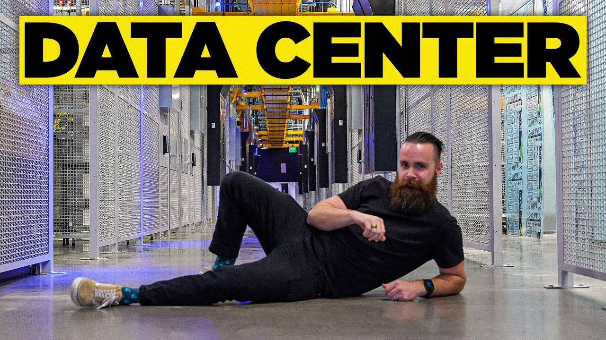</a> | <a href="https://youtu.be/gsN_CJJDy_o" target="_blank">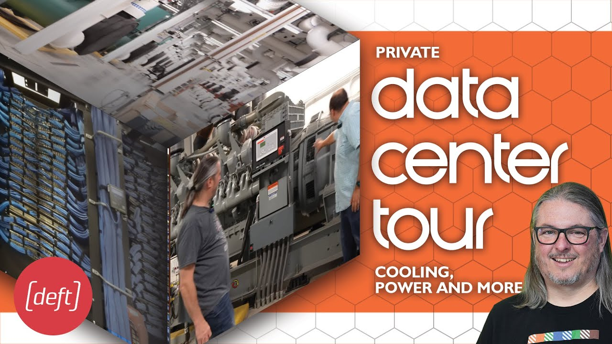</a> |


## The Physical Building Blocks

### The Server

A server is essentially a highly specialized, incredibly powerful computer. Unlike a home laptop built for battery life and a screen, a server is built purely for performance and reliability.

- **CPU (Central Processing Unit):** The "brain." Servers often have multiple CPUs with dozens of cores to handle thousands of requests simultaneously.

- **RAM (Memory):** The short-term workspace. Servers contain massive amounts of RAM to keep data ready for instant access.

- **Storage (SSD/HDD):** Where the actual data lives permanently.

- **NIC (Network Interface Card):** The ports where the network cables plug in, allowing the server to communicate with the rest of the network.


### The Rack

Servers are not stacked on top of each other on the floor. They are bolted into racks—standardized metal frames (usually 19 inches wide) designed to hold servers, switches, and power units (PDUs, which act as industrial power strips for the rack).

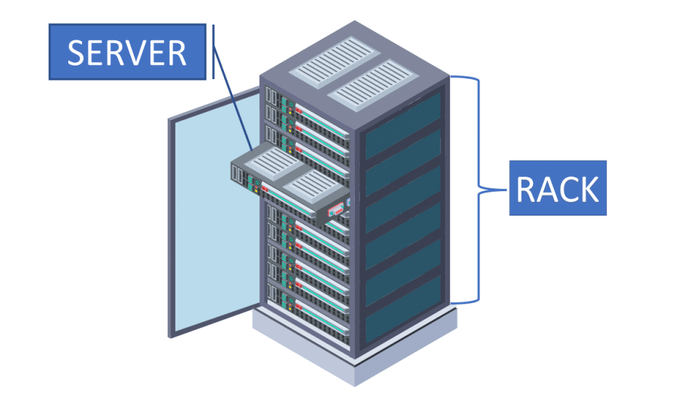


Racks are essential because:

- **Space Efficiency:** Racks allow you to stack dozens of flat, pizza-box-sized servers vertically.

- **Organization:** They provide a structured way to route power cables and network cables.

- **Airflow Management:** Racks organize servers so that they all draw cold air from the front and exhaust hot air out the back, maintaining safe operating temperatures.


### The Rack Unit (RU or U)

Once you have a rack, you need a standard way to measure the space inside it so you know exactly how many servers will fit. This is where the Rack Unit (abbreviated as RU or simply U) comes in.

Think of an RU as the standard unit of measurement for data center real estate.

- **Height:** One Rack Unit (1U) is exactly 1.75 inches (44.45 mm).

- **Standard Rack:** A standard, full-sized data center rack is usually 42U tall (roughly 6 to 7 feet including the frame), providing 42 available slots of space.

When you buy equipment for a data center (server, network switch, or a power distribution unit) its height is always listed in U's.


### Server Form Factors (Sizes)

Because data center space is highly standardized, server manufacturers build servers to fit perfectly into these Rack Units. We refer to the physical size and shape of the server as its Form Factor.

Depending on how much computing power, memory, or storage a specific job requires, servers are built in different sizes:

| Form Factor  | Height                     | Description & Hardware Profile                                                                                                                                                                        | Typical Use Cases                                                                                  |
| ------------ | -------------------------- | ----------------------------------------------------------------------------------------------------------------------------------------------------------------------------------------------------- | -------------------------------------------------------------------------------------------------- |
| 1U Server    | 1.75 inches                | The standard "pizza box" server. Extremely dense, usually containing 1-2 CPUs, standard RAM, and limited internal storage. Fans must spin very fast (and loud) to cool the tightly packed components. | Web hosting, basic application servers, domain controllers, firewalls.                             |
| 2U Server    | 3.5 inches                 | The "sweet spot" for most enterprise data centers. Twice as thick as a 1U, allowing for larger cooling fans, dual power supplies, and significantly more hard drives in the front chassis.            | Database servers, virtualization hosts (running multiple virtual machines), heavy storage servers. |
| 4U Server    | 7.0 inches                 | A massive, heavy chassis. It provides maximum internal space for specialized hardware, massive arrays of hard drives, or large PCIe expansion cards.                                                  | Artificial Intelligence (AI) training clusters loaded with GPUs, massive data warehousing.         |
| Blade Server | Varies (e.g., 10U Chassis) | Instead of independent rack servers, multiple ultra-thin "blades" slide into a massive shared chassis. The chassis provides shared power, cooling, and networking to all the blades inside it.        | High-performance computing (HPC), environments requiring extreme density and simplified cabling.   |

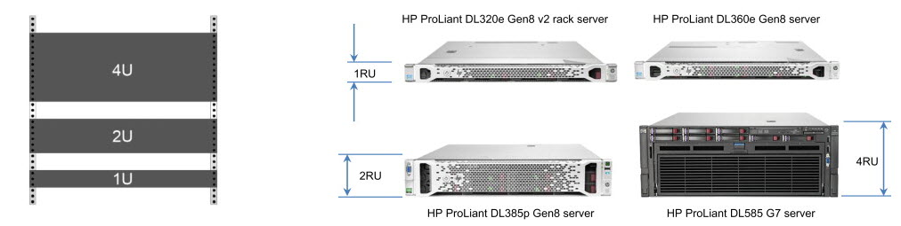

> The image above shows rack-mount form factors (1U, 2U, 4U). Blade servers use an entirely different physical configuration—a shared chassis into which individual blade modules slide—and are not pictured here.

> **Note on 3U Servers:** While 3U servers (5.25 inches tall) do exist, they occupy an inefficient middle ground in modern data centers. The industry heavily favors 1U and 2U for dense, general-purpose computing, while 4U provides the exact vertical clearance needed to mount full-height, full-length PCIe cards (such as AI GPUs) without requiring horizontal risers. A 3U chassis consumes more rack space than a 2U but still lacks the native vertical clearance of a 4U, relegating it to niche use cases such as telecom, legacy broadcast gear, and specialized storage arrays.


### Why Do Servers Look Different from PCs?

If you look at a standard desktop PC or workstation, it is usually a vertical tower. A data center server, however, is wide, deep, and incredibly thin. This dramatic difference in shape comes down to three main data center requirements:

- **Maximum Density:** Floor space in a data center is incredibly expensive. By making servers flat and standardizing the width to exactly 19 inches, you can slide dozens of them horizontally into a single rack, stacking them vertically to maximize every square inch.

- **Standardized Rail Mounting:** Unlike a PC that sits on a desk, rack servers are mounted on sliding metal rails. The wide, flat chassis gives the server the structural integrity to be pulled out of a rack like a drawer so a technician can open the top and replace parts without unplugging the whole unit.

- **Front-to-Back Airflow:** A PC tower has fans blowing in multiple directions. A rack server is designed as a wind tunnel. Cold air is drawn in exclusively through the front panel, pulled forcefully over the hot CPUs, and exhausted straight out the back.


### Data Center Slang

In the IT industry, any 1U (1.75-inch tall) rack-mounted device — server or switch — is colloquially called a **pizza box** because it closely resembles a flat, square delivery box.

A **white Box** refers to generic, unbranded hardware assembled from commercial off-the-shelf components, rather than being bought from a premium, name-brand vendor (like Dell, HP, or Cisco).

- **White Box Servers:** A company might buy a white box server from an Original Design Manufacturer (ODM). It performs the same function as a branded server but costs significantly less because the buyer is not paying for the brand name or proprietary management software.

- **White Box Switches:** This is a major trend in data center networking. A white box switch is a generic piece of switching hardware (usually a pizza box) that allows the operator to install any Network Operating System (NOS)—similar to installing Linux on a generic PC. Under the hood, the NOS interfaces with the underlying switching silicon (the ASIC) through a standardized hardware abstraction layer, allowing a single operating system to control different hardware platforms seamlessly.


### The Rack vs. Blade Trade-Off

Looking at the table above, you might wonder: If blade servers are so dense and share power and cooling, why doesn't everyone just use them instead of 1U or 2U rack servers? It comes down to business requirements and facility limits:

**The Case for Rack Servers (Pizza Boxes):** Rack servers are the ultimate commodity. They have a very low initial Capital Expenditure (CapEx), and you can scale your data center one single server at a time. If a new generation of CPUs is released, you simply slide out an old 1U server and slide a new one in.

**The Case for Blade Servers:** Blades drastically reduce cable clutter and allow you to pack an extreme amount of computing power into a small footprint. However, they come with a significant upfront cost because you must purchase the expensive chassis first, even if you only populate it with two blades. Furthermore, a fully loaded blade chassis creates extreme power density (traditionally drawing 10 kW to 15 kW+ per rack compared to a conventional 5 kW to 8 kW, and significantly higher in modern AI-driven deployments), which many older data center cooling systems cannot handle.


### Colocation Suites (Cages)

While some massive companies (like Google or Meta) own their entire data center, many facilities operate on a "colocation" (colo) model. In a colocation data center, the facility owner provides the physical building, power, and cooling, but rents out the floor space to different organizations. Because multiple companies share the same data center floor, they need physical security. A colocation suite uses modular, secured partitions—typically heavy wire mesh cages or walled rooms—to lock a specific tenant's cabinets away from anyone else walking the floor.

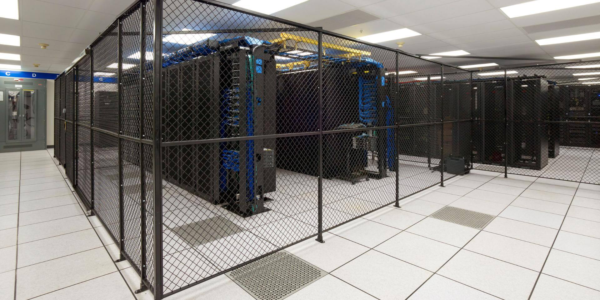


## Understanding the Facility Layout

The following diagram illustrates the macro-level layout of a typical data center. The facility is color-coded to show how the different critical systems interact to support the computing hardware:

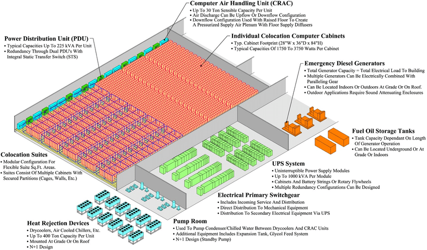

* **The IT Load (Pink/Red Center):** This massive central grid is the core of the data center. It represents the racks of servers, switches, and storage arrays, organized into individual colocation cabinets and grouped within secured partitions known as Colocation Suites.

* **Cooling Infrastructure (Light Blue):** This highlights the mechanical loop required to remove heat from the IT load. It includes the indoor CRAC/CRAH (Computer Room Air Conditioner / Computer Room Air Handler) units lining the walls, the Pump Room that circulates chilled fluid, and the outdoor Heat Rejection Devices (Chillers/Drycoolers) that expel the absorbed heat into the atmosphere.

* **Power Distribution & Conditioning (Green):** This represents how raw utility electricity is refined and delivered. Power enters through the Electrical Primary Switchgear, flows through the UPS System (Uninterruptible Power Supply) which provides instant battery backup, and is finally routed to the PDUs (Power Distribution Units) that safely deliver the power down the rows of cabinets.

* **Emergency Backup Power (Orange):** This shows the brute-force emergency system. The large Emergency Diesel Generators and their dedicated Fuel Oil Storage Tanks sit ready to take over the facility's massive power load in the event of an extended utility grid blackout.

A purpose-built data center carefully isolates its critical infrastructure physically. Facilities often utilize a top-down design philosophy: fluid-based cooling systems, chillers, and heavy generators are placed on the upper floors or roof. If a catastrophic mechanical failure or leak occurs, gravity pulls the hazard downward and away from the critical IT load. Conversely, bulk diesel fuel tanks are buried underground to prevent them from floating away during severe ground-level flooding.


## The Data Center Floor

Before servers can be installed, the physical room must be engineered to handle massive amounts of power and heat.


### The Raised Floor System

Most traditional data centers suspend the room's floor 18 to 36 inches above the building's true concrete slab. Because concrete slabs are rarely level and flex under weight, a raised floor provides a flat, highly customizable surface for rolling, aligning, and powering heavy server cabinets.

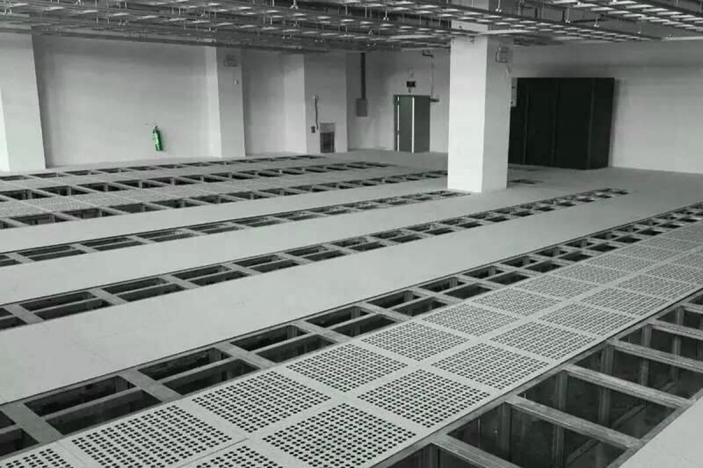

Once the floor is raised, the resulting hollow space underneath is called the **plenum**. Its primary job is to act as a massive pressurized duct to distribute cold air from the perimeter cooling units across the room.

- **Perforated Tiles:** Solid floor panels in the cold aisles are replaced with perforated grate tiles, allowing pressurized cold air to rise upward into the server intakes.

- **The Damper Penalty:** Some perforated tiles use adjustable dampers (louvers) on the bottom to balance air delivery. However, the physical mechanism of a damper drastically reduces the tile's airflow capacity—even when 100% open, it can reduce the tile's open percentage by nearly half.

- **Airflow Obstructions:** While power cables are often routed through the plenum, a buildup of abandoned cables under the floor blocks air delivery. This creates air turbulence and localized hot spots, which is why modern data centers strictly route data cables overhead.


### Overhead Cable Management

Over the past several decades, the massive increase in hyperscale hardware and bandwidth requirements forced a fundamental shift in data center cable design. Historically, routing cross-connects and trunk cables under the raised floor was convenient. However, as cable density exploded, these underfloor pathways became a major liability. Thick bundles of cable choked the subfloor air plenum, driving up ambient temperatures and ruining cooling efficiency.

To solve this, modern facilities migrated all data cabling (both fiber and copper) to overhead suspended trays. This move provides three distinct advantages:

- **Unobstructed Cooling**: It keeps the under-floor plenum completely clear for pressurized chilled air.

- **Accessibility**: Cables are visible and accessible for tracing and maintenance without lifting heavy floor tiles in a live environment.

- **Isolation**: It physically separates low-voltage data cables from high-voltage power, reducing electromagnetic interference.

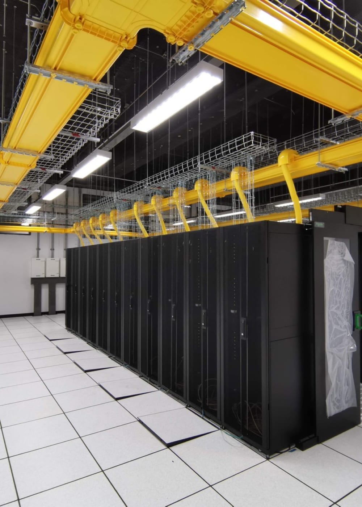

While overhead trays solve the airflow problem, they introduce a new challenge: strict capacity limits. Unlike the deep underfloor plenum, suspended trays must abide by strict structural and code standards.

The Telecommunications Industry Association (TIA-942) standard limits cable tray capacity to a strict 40 percent fill rate, while the National Electrical Code (NEC Article 392) caps it at 50 percent. Because engineers can legally use less than half of the tray's physical volume, the outer diameter and weight of high-core-count fiber cables are critical design factors.

This strict fill-rate standard is precisely why modern fiber trays have evolved from a mere 6 inches wide in the early 2000s to massive 24-inch wide trays today.


### Ultra-Low Latency Cabling

In highly specialized environments like high-frequency trading, or massive HPC clusters relying on lossless transports like RoCEv2 and RDMA, physical distance becomes a measurable bottleneck. When you are engineering networks down to the microsecond, the physical speed of light through glass matters.

- **Equidistant Trading**: In financial colocation sectors, if one tenant's cage is physically closer to the main facility router than a competitor's, they gain an unfair physical latency advantage. To neutralize this, the facility enforces equidistant cabling: they run the exact same length of fiber optic cable to every tenant, regardless of where their cage is located on the floor. The excess fiber for the closer cages is kept on highly secured spools.

- **Microwave Arrays**: Light travels slower through fiber optic glass—about two-thirds of its theoretical maximum speed in a vacuum. To bypass this physical limitation entirely, some ultra-low latency tenants utilize roof-mounted microwave arrays. These provide direct, line-of-sight data transmission through the air to neighboring financial exchanges, shaving off critical microseconds that fiber cannot physically match.


## Physical Security and Access Control

Data centers house billions of dollars of hardware and the world's most sensitive data, making physical security just as critical as cybersecurity. Facilities are designed as multi-layered security perimeters. Reaching a server requires passing through:

- **Defensive Architecture**: Purpose-built data centers often elevate the entire ground floor foundation by several feet. This prevents a vehicle from ramming into the facility, eliminating the need for visually intrusive concrete barriers around the perimeter.

- **Perimeter Fencing:** Controlled entry points with 24/7 staffed guardhouses.

- **Biometric Checkpoints:** Fingerprint or retina scanners that verify authorized personnel.

- **Man Traps (Security Vestibules):** A specialized, interlocking double-door system. When a person enters, the first door must close and lock before the second door can be opened. This eliminates "tailgating," ensuring that an unauthorized person cannot slip in behind an authorized employee.

- **Advanced Colocation Cages**: Security extends to the individual tenant level. High-security cages feature opaque visual blockers so competitors cannot analyze the hardware footprint, solid roofs to prevent physical intrusion from above, and touch-sensitive mesh that automatically dispatches security if leaned against.

- **Dual-Access Policies**: For extreme compliance requirements, cages may require double-access authentication, meaning the door will only unlock if a facility employee and an authorized tenant employee scan their biometric credentials simultaneously.

- **Blue Lighting**: While it looks like an aesthetic choice, casting the data halls in dark blue light makes it physically difficult for competitors walking the floor to read the tiny serial numbers, asset tags, or vendor labels on the hardware inside the cages.


## Fire Suppression and Life Safety

While physical security keeps unauthorized people out, fire suppression protects the hardware from environmental disasters. Data centers use highly specialized systems to detect and suppress fires without destroying the sensitive IT equipment they are trying to save.

- **VESDA (Very Early Smoke Detection Apparatus)**: Instead of waiting for visible smoke to trigger an alarm, VESDA systems continuously sample the ambient air through specialized PVC piping. They detect microscopic combustion particles, allowing operators to triangulate and address a potential smoldering wire long before a fire actually starts.

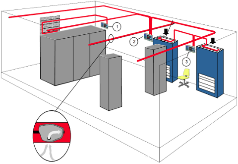

- **Pre-Action (Dry-Pipe) Sprinklers**: Flooding a server room with water is a last resort. To prevent accidental water damage from a single broken sprinkler head, the pipes running directly over the servers are filled with pressurized inert gas, not water. Water only floods the pipes if two independent systems (e.g., both a heat sensor and a smoke detector) are triggered simultaneously.

- **Flame-Detecting Cameras**: In areas like the backup generator room, standard smoke detectors would constantly trigger false alarms due to normal diesel exhaust. Instead, these rooms use specialized cameras that can see through smoke and detect the actual optical signature of a flame.

- **Life Safety Considerations**: Historically, some facilities used oxygen-depletion gas to choke out fires. However, because these systems pose a severe, potentially lethal risk to any personnel trapped inside the data hall, many modern facilities opt for tightly controlled pre-action water systems instead.


## Cooling the Data Center

### Hot and Cold Aisles

To optimize cooling efficiency, servers are never placed facing the same direction row after row. Instead, they are strategically arranged in an alternating pattern known as Hot Aisle / Cold Aisle layout.

- **Cold Aisle (Intake):** Racks are positioned so that the fronts of the servers face each other across the aisle. Perforated tiles are placed in the raised floor of this specific aisle, allowing chilled air circulating in the plenum below to rise directly upward. The servers draw this chilled air into their front intakes.

- **Hot Aisle (Exhaust):** In the next row, the backs of the servers face each other. After the servers pull cold air over their hot internal components, they exhaust the resulting heated air out the back into this shared aisle. This separation efficiently channels hot air for removal by the facility's cooling systems.


### Device-Level Airflow Matching

While standard servers almost universally pull cold air in the front and exhaust it out the back, networking equipment such as switches operates differently. Depending on how the rack is cabled, a network engineer might need to mount the switch with its network ports facing the Hot Aisle or the Cold Aisle.

To maintain the strict integrity of the data center's cooling design and prevent a switch from fighting the room's engineered airflow, network switches use modular, physically reversible fan and power supply units.

Because terminology often differs between facility management and hardware vendors, both common naming conventions are outlined below:

| Acronym      | Full Name                          | Airflow Direction    | DC Role         | Cold Aisle Orientation            |
| ------------ | ---------------------------------- | -------------------- | --------------- | --------------------------------- |
| F2B (or C2P) | Front-to-Back (Connector to Power) | Ports → Power Supply | Forward airflow | Front (Ports) face the cold aisle |
| B2F (or P2C) | Back-to-Front (Power to Connector) | Power Supply → Ports | Reverse airflow | Rear (Power) faces the cold aisle |

> A Note on Color Coding: Vendors typically color-code fan and PSU handles to prevent accidental mixing. While standard conventions often use Blue to denote cold-air intake and Red to denote hot-air exhaust, this varies heavily by manufacturer. Always verify the vendor's specific documentation before installation.

| F2B / C2P (Port-Side Intake)                           | B2F / P2C (Port-Side Exhaust)                             |
| ------------------------------------------------------ | --------------------------------------------------------- |
| 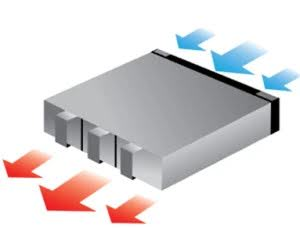 | 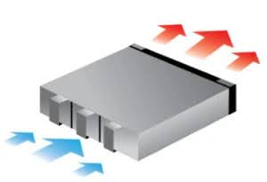    |

Maintaining consistent airflow direction across rack equipment is essential. If a device is installed with the wrong orientation, or if mixed fan modules are accidentally installed in the same chassis, it can disrupt aisle containment, cause hot air to recirculate into the intake path, and lead to localized thermal shutdowns. Furthermore, before a switch fully powers off, localized thermal stress can impact internal buffer memory and cause physical-layer network errors. In high-speed environments where congestion control mechanisms are critical, these heat-induced hardware errors can cascade into significant network performance degradation.


### The Evolution of Airflow Management

While the basic Hot/Cold aisle layout is essential, engineers have continuously improved how strictly that air is managed to prevent thermal damage.

**Stage 1: Conventional Cooling (The Baseline)**

Standard open rows using the raised floor and perforated tiles.

Because the aisles are open at the top and ends, the hot exhaust air can easily drift over the tops of the racks and mix with the cold air. This mixing is highly inefficient and forces the cooling units to work much harder than necessary to keep the room cool.

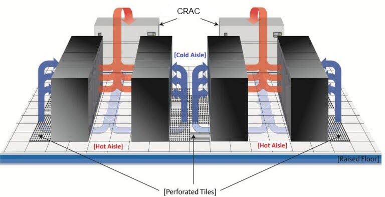

**Stage 2: Cold Aisle Containment (CAC)**

To fix the mixing problem, engineers added physical doors to the ends of the Cold Aisle and built a physical roof directly over the top of it.

The cold air rising from the floor is completely trapped inside this sealed enclosure. The servers are guaranteed to receive only pure chilled air. The hot exhaust air is expelled into the rest of the open room, eventually returning to the cooling units.

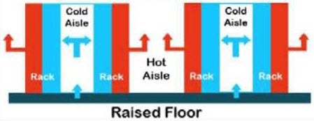


**Stage 3: Hot Aisle Containment (HAC)**

This is the reverse of CAC and is generally considered the most efficient air-cooling method for modern data centers. Instead of trapping the cold air, physical walls and a roof are built to seal off the Hot Aisle.

The entire data center room acts as a giant cold aisle. The servers pull cold ambient air straight from the room and exhaust their heat into a sealed "chimney" (the Hot Aisle). This trapped, concentrated heat is then ducted directly back into the cooling units, preventing a single drop of hot air from escaping into the room.

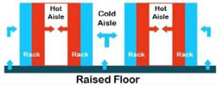


### Thermal Design Validation (CFD Modeling)

Before building these aisles and installing millions of dollars of hardware, engineers use Computational Fluid Dynamics (CFD) software to simulate and visualize the airflow.

The software generates a color-coded map. Blue and green areas (50°F - 70°F) represent the chilled, safe air in the cold aisles. Yellow, orange, and red areas (70°F - 90°F+) represent the dangerous heat exhausted into the hot aisles.

Engineers use these heat maps to spot "hot spots" before they cause physical damage. They can see exactly where cold and hot air might be accidentally mixing, or identify if a specific, high-density server rack is generating too much heat and requires more dedicated airflow.

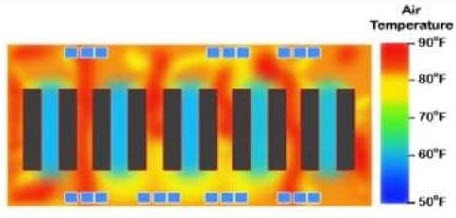


### The Cooling Infrastructure Loop

Now that we understand how the room is organized into hot and cold aisles and how that layout has evolved, we can examine the mechanical equipment that actually produces the cold air and removes the heat. Cooling a data center requires a massive, multi-stage mechanical loop to extract heat from the server room and push it out into the atmosphere. This system is broken down into three main stages:

**CRAC/CRAH Units (Computer Room Air Conditioners / Air Handlers)**

These are massive, industrial-grade cooling units positioned around the perimeter of the room. Unlike CRAC units (which contain their own compressor-based refrigeration), CRAH units receive chilled water from an external chiller plant via pipes. They take in the hot exhaust air generated by the servers, pass it over internal chilled-water coils, and pump the resulting cold air directly into the hollow space under the raised floor.

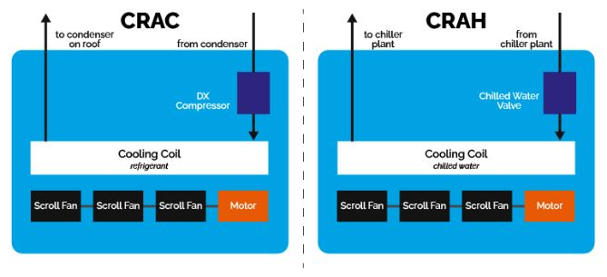

**The Pump Room**

To move thousands of gallons of fluid between the indoor CRAH units and the outdoor Heat Rejection Devices, the data center relies on a dedicated Pump Room. This is the mechanical heart of the cooling loop. It houses the heavy-duty water pumps, expansion tanks (to handle pressure changes as the fluid heats and cools), and glycol feed systems (which prevent the fluid from freezing when it's pumped outside in winter). Just like the cooling units, the pump room is built with N+1 design (one more unit than the minimum required, so a spare is always available), ensuring there is always a standby pump ready to keep the chilled water circulating.

**Heat Rejection Devices (Chillers & Drycoolers)**

While the CRAH units handle the indoor cooling by absorbing server heat into a closed loop of water or glycol, that heat ultimately has to be removed from the building. This is handled by Heat Rejection Devices mounted outside, either on the roof or at grade level. These massive units (which can be drycoolers or air-cooled chillers) receive the hot fluid from the indoor CRAH units, use the outside ambient air to cool it back down, and then send the chilled fluid back inside. Because cooling is critical, these are typically designed with "N+1" redundancy, meaning there is always at least one extra unit ready to take over if another fails or requires maintenance.

**Evaporative Boosting (Misters)**

Data centers must be designed for worst-case thermal scenarios, such as extreme summer heat domes. Under these conditions, the facility can activate misters to spray a fine coating of water directly onto the rooftop drycoolers. This triggers evaporative cooling, drastically dropping the air temperature around the fins and temporarily boosting the system's heat rejection capacity.

**Deep Lake Water Cooling (DLWC)**

Some cutting-edge facilities bypass mechanical chillers entirely by utilizing natural, geological heat sinks. By drawing highly pressurized, naturally freezing (4°C) water from the bottom of deep lakes or oceans, the facility can cool its internal heat exchangers almost entirely for free.


### The Next Generation: Liquid Cooling

For the newest, most powerful AI servers—like NVIDIA's DGX SuperPODs—air cooling, even with perfect Hot Aisle Containment, is no longer physically sufficient. The rise of AI has fundamentally changed physical rack design. A single AI rack can consume over 100 kW of power, meaning a small 8-rack cluster can draw over a megawatt—more than an entire legacy data center.

To handle this extreme thermal load, modern high-performance data centers use Direct-to-Chip Liquid Cooling. Instead of relying on fans to push air, tubes of specialized coolant are routed directly into the server chassis and over the processors. Liquid absorbs and transfers heat far more efficiently than air, keeping components within safe operating temperatures.

Liquid cooling also provides a second critical benefit: space compression. By replacing bulky metal air heatsinks with ultra-thin liquid cold plates, engineers can pack compute trays tightly together. Because the GPUs are physically closer, they can communicate over copper backplanes instead of expensive optical transceivers. This extreme physical density provides the signal integrity needed for 72 GPUs to operate as a single, unified AI accelerator.


## Powering the Data Center

```text
                                                  +----> [ UPS A ] ----+
                                                  |       Feed A       |
[ Utility Grid ] --> [ Transformer ] --> [ ATS ] -+                    +--> [ STS ] --> [ Floor PDU ] --> [ RPP ] --> [ rPDU ] --> [ Servers ]
                                            ^     |       Feed B       |
                                            |     +----> [ UPS B ] ----+
                                     [ Generator ]

ATS       = Switchgear & Automatic Transfer Switch (Utility <-> Generator), 10-30s mechanical transfer
STS       = Static Transfer Switch (Feed A <-> Feed B), ~4ms solid-state transfer
UPS A / B = Online Double-Conversion (AC-DC-AC), zero-break battery bridge
Floor PDU = Voltage step-down cabinet (e.g. 480V -> 208V)
RPP       = Remote Power Panel (breaker distribution on the floor)
rPDU      = Rack PDU (intelligent power strip inside the rack)
```

### Phase 1: Bringing Power In (and Keeping It On)

**Utility Power Feeds and Transmission**

The primary source of electricity. Modern data centers do not rely on just one power line. Higher-tier facilities typically have multiple, independent power feeds coming from different utility substations (and in the case of Tier IV designs, from entirely separate utility grids) to ensure that if one feed goes dark, the data center does not.

**Transformers**

Power travels from the utility plant across transmission lines at incredibly high voltages to move efficiently over long distances. Before the data center can safely use this electricity, massive transformers sitting just outside the building must step that extreme voltage down to a facility-level voltage (typically 480 volts).

**Switchgear**

Think of the Switchgear as the master circuit breaker panel for the entire facility. It receives the power from the transformer, protects the sensitive downstream equipment from electrical surges, and routes the power into the building.

**ATS (Automatic Transfer Switch)**

Housed within or right next to the switchgear is the ATS. It constantly monitors the incoming utility power. If it detects a blackout, it physically switches the data center's power source away from the dead utility grid and over to the backup generator. It also sends the start signal to the generator so it begins spinning up immediately.

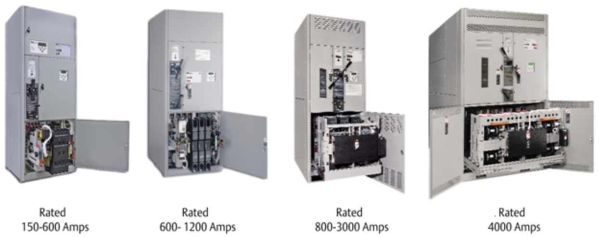

**Backup Generators**

These are massive diesel or natural gas engines that provide long-term backup power. Once the ATS signals them, they start up immediately. As long as the generators are fueled, the data center will stay online indefinitely. However, there is a critical problem: generators take 10 to 30 seconds to spin up and stabilize. A server will crash if it loses power for even a few milliseconds. This gap between the utility dying and the generator being ready is where the UPS comes in.

**UPS (Uninterruptible Power Supply)**

The UPS solves the generator startup gap. Data centers use an Online Double-Conversion UPS — a massive room filled with industrial batteries (or mechanical flywheels) that sits permanently inline in the power path. During normal operation, incoming AC power is continuously rectified to DC (charging the batteries along the way), and then an inverter converts it back to clean AC for the downstream equipment. The servers never know it is there. Because the inverter is always running and the batteries float on the shared DC bus, the moment utility power drops, the batteries take over the DC bus with zero transfer time — no switching delay, no signal needed from the ATS. The UPS holds the load on battery for the few minutes it takes the generator to come online. Once the generator is stable, the ATS switches the upstream source to the generator, and the UPS resumes its normal AC-DC-AC conversion cycle.

**Power failure timeline:**

1. Utility power fails.
2. UPS continues delivering power seamlessly (the inverter is already running from the DC bus—zero transfer time).
3. ATS detects the failure and sends the start signal to the generator.
4. Generator takes 10–30 seconds to spin up and stabilize.
5. Once the generator is stable, the ATS switches the source from the dead utility to the generator.
6. UPS resumes normal double-conversion from the generator feed.

**STS (Static Transfer Switch)**

Recall that ATS sits at the facility entrance, between the utility grid and the backup generators. Its job is macro-level source selection: "Are we running on utility power or generator power?" It uses physical mechanical contacts, so the transfer takes roughly 10–30 seconds (which is why the UPS exists to bridge that gap). There is typically one or a small number of ATS units for the whole facility.

STS sits much closer to the IT load, typically at the room or row distribution level. Its job is micro-level feed redundancy: "Which of my two independent UPS-backed power feeds (A or B) is healthier right now?" Because it uses solid-state silicon (thyristors) instead of mechanical contacts, it switches in ~4 milliseconds — fast enough that servers never notice.

So the ATS handles the upstream problem (grid vs. generator), and the STS handles the downstream problem (Feed A vs. Feed B). A facility-wide generator switchover might cause one UPS feed to wobble briefly — the STS ensures the servers never feel it.

- The STS receives two completely independent power feeds (Feed A and Feed B) from the facility's upstream UPS systems.
- It constantly monitors both feeds for voltage drops or dirty sine waves.
- If Feed A fails or degrades, the STS instantly snaps the downstream load over to Feed B.
- Clean, uninterrupted power continues flowing down to the Floor PDUs and into the server racks.

**Load Bank Testing**

To ensure the backup generators and UPS systems can handle the massive inrush current and sustained draw of a fully loaded server floor, facilities perform routine load testing. They connect massive resistive heaters called **load banks** that simulate the intense electrical draw and heat output of the servers, ensuring the emergency systems operate flawlessly before a real blackout occurs.

**Fuel Oil Storage Tanks**

Emergency Diesel Generators provide the brute force needed to keep a data center running during an extended blackout, but they are completely reliant on their fuel supply.

To support this, data centers maintain massive Fuel Oil Storage Tanks. These bulk tanks can be located underground, indoors, or outdoors at grade level. The size of these tanks dictates the facility's survival time—they are typically sized to hold enough fuel to run the generators for a specific number of days (e.g., 48 to 72 hours) before a refueling truck needs to be dispatched to the site.

**Grid Demand Response (Islanding)**

Because a large data center can consume a significant percentage of an entire city's power budget, the facility must work closely with the local utility. During extreme grid stress, the utility company may remotely signal the data center to "island" itself—voluntarily dropping off the public grid and running entirely on its own generators to prevent municipal rolling blackouts.

**On-Site Power Generation (Fuel Cells & Solar)**

While data centers have historically relied on the utility grid backed up by dirty diesel generators, the massive power draw of modern facilities is forcing a shift toward clean, on-site power generation. Facilities are increasingly installing Solid Oxide Fuel Cells on their campuses. These run on natural gas and generate megawatts of electricity through a chemical reaction rather than combustion. This provides cleaner baseline power, reduces reliance on the strained public utility grid, and eliminates the transmission loss that occurs when power travels miles over overhead lines.


### Phase 2: Distributing Power to the Racks

Once the power is safely flowing through the switchgear and UPS, it is still too powerful to plug into a server. It must be stepped down and divided up into thousands of individual connections.

**Floor PDU (Power Distribution Unit)**

Power leaves the UPS and heads to a Floor PDU. This is a large, floor-standing cabinet that takes the heavy facility power and steps the voltage down one final time (e.g., from 480V down to 208V). Any further step-down to 120V, where needed, typically happens downstream at the rack level.

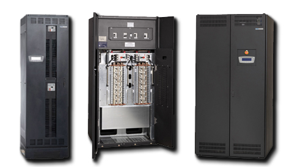

**RPP (Remote Power Panel)**

Power cannot be run directly from a Floor PDU to a server. First, it goes to an RPP. These are distribution cabinets located directly on the data center floor, often at the end of a row of racks. They take the power from the Floor PDU and break it down into smaller, manageable circuits. They contain dozens of standard circuit breakers and push the power out into individual cables (often called "whips") that run under the raised floor to specific racks.

**Rack PDU (Power Distribution Unit)**

Finally, the power arrives at the rack. An rPDU is essentially a highly intelligent, industrial-grade power strip. They are mounted vertically inside the server rack. The cable from the RPP plugs into the rPDU, and the servers plug directly into the rPDU to receive their power.


## Rack Power Distribution Units (PDUs)

The previous section introduced the rPDU as the final link in the power chain. Here we break down the four distinct capability tiers available.

A PDU is a rack-mountable device that takes electrical power from a main feed (like a wall supply or a UPS) and distributes it to many devices through multiple outlets. They provide circuit protection and safe load handling, and depending on the type, they may also measure power usage or allow remote control.

| **Type**  | **Key Value Add**                                     | **Network telemetry?** | **Remote power-cycle?** |
| --------- | ----------------------------------------------------- | ---------------------- | ----------------------- |
| Basic     | Reliable power distribution only                      | ❌ No                  | ❌ No                  |
| Metered   | Power distribution + human-visible real-time metering | ❌ No                  | ❌ No                  |
| Monitored | Power distribution + network-exportable telemetry     | ✔ Yes                  | ❌ No                  |
| Switched  | Power distribution + telemetry + outlet relays        | ✔ Yes                  | ✔ Yes                  |

### Basic PDUs

Basic PDUs are essentially industrial-grade power strips built for infrastructure environments. Their sole responsibility is reliable electrical distribution: they take power from a single input source (like a UPS or wall feed) and fan it out to many devices safely. They do not measure, report, or control anything beyond delivering electricity.

Because they lack sensing or network components, they introduce minimal firmware, configuration, or failure complexity—sometimes a deliberate advantage in small or low-budget installations. The trade-off is total blindness: there is no visibility into load balance, overheating risk, PDU health, or per-device consumption. If something is drawing too much power or the input feed is unstable, the problem is only discovered indirectly (via breaker trips or device failure).

Basic PDUs are suitable when uptime matters but telemetry does not. Typical deployments include small fixed-compute racks, office wiring closets, and home labs.

### Metered PDUs

Metered PDUs extend basic distribution with power sensing circuitry. This circuitry is typically driven by a local microcontroller that reads voltage, current, or wattage from the input or outlet bus and displays it on a front-panel LCD. Unlike basic PDUs, metered units are electrically aware, helping operators avoid overloading power budgets or circuits.

The key limitation is that metering is front-panel only. Data lives on the device but is not exported or stored externally unless manually logged. Metered PDUs are operator-focused, not analytics-focused: they help technicians make real-time decisions (e.g., “Is this rack drawing 8A or 12A right now?”) but do not provide alerting, automation, or long-term trend analysis.

Typical deployments include small server racks, broadcast equipment stacks, telecom cabinets, and test environments where technicians need instant power confirmation.

*A 19-inch 1U metered PDU from Hapidot:*

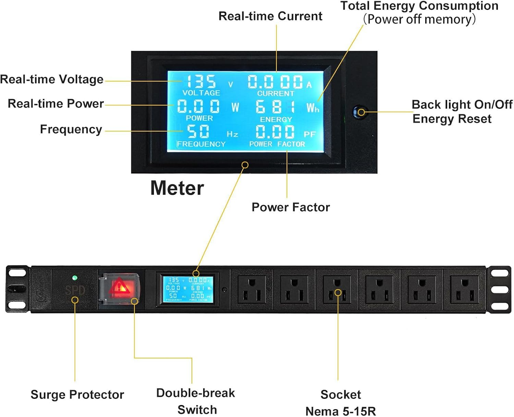

### Monitored PDUs

Monitored PDUs evolve from "local display" to "network telemetry source." They still distribute and meter like a metered PDU, but add an Ethernet (or sometimes serial/SNMP/Web/API) management interface so power data can be pulled remotely by software. The PDU exposes real-time consumption and often stores internal timestamps for historical views retrievable by external monitoring systems (such as DCIM platforms, or time-series databases like Prometheus with Grafana dashboards).

Importantly, the PDU itself is not a data center analytics system—it is a data producer. This enables central systems to correlate power draw with environmental telemetry, capacity planning, anomaly detection, or energy compliance. However, individual outlets usually remain non-controllable: operators can see the power data but cannot power-cycle specific devices remotely.

Monitored PDUs are ideal for facilities that require telemetry-driven operations but do not need remote power switching, including colocations or data centers where outlet toggling is restricted by policy or handled via server-side BMC/automation.

### Switched PDUs

Switched PDUs combine distribution, metering, and remote outlet control. Each power receptacle is backed by a digitally addressable relay that allows software to toggle it on or off. This is what makes a switched PDU fundamentally different from a monitored PDU—not more metering, but hardware-level actionability. An automation system can reboot a hung server or disable a faulty device without physical intervention, which is critical at scale or in unmanned installations.

Because relays are individually addressable, switched PDUs are common in automation-heavy environments and are tightly integrated into operational playbooks: remote reboot loops, triggered recovery, and staged power-on sequencing to avoid simultaneous inrush spikes. However, this increases the blast radius if misconfigured—automation errors can cause outages.

Typical deployments include remote PoPs, lab racks, AI clusters, and production data centers where an orchestrator must have physical power control to recover devices automatically.

*A 1U switched PDU from APC:*

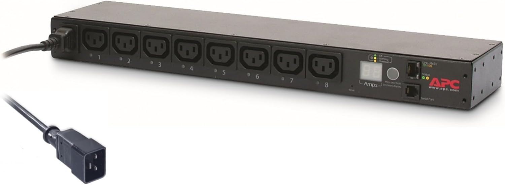

*APC AP8941 switched PDU:*

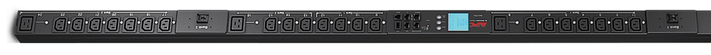


## Measuring Efficiency (PUE)

Because cooling and power distribution require massive amounts of electricity, data centers need a metric to calculate how much power is actually doing useful work versus how much is being "wasted" on overhead.

This metric is called PUE (Power Usage Effectiveness). It is the gold standard for measuring data center efficiency.

```
PUE = Total Facility Power ÷ IT Equipment Power
```

- **Total Facility Power:** Every watt of electricity entering the building. This includes the servers, plus the cooling units (CRAC/CRAH), UPS battery charging, generator heaters, lights, security cameras, etc.

- **IT Equipment Power:** The electricity strictly consumed by the computing equipment (servers, network switches, and storage arrays).

A perfect (but physically impossible) PUE is 1.0. This would mean exactly 100% of the power entering the building is going into the servers, with zero power used for cooling or lights. If a facility draws 200,000 Watts total, and the servers use 100,000 Watts, the PUE is 2.0. (This means for every watt used to power a server, another watt is used to cool it).

> PUE is the exact mathematical inverse of DCiE (Data Center Infrastructure Efficiency).


### Strategies for Maximizing Efficiency

Because electricity is the single highest ongoing cost of running a data center, companies go to extreme lengths to lower their PUE closer to 1.0.

**Raise the Temperature**

Traditionally, data centers were kept freezing cold (18-20°C / 64-68°F). Modern companies realized this wastes millions of dollars. Google famously raised their aisles to 27°C (80°F), and some are pushing limits up to 35°C (95°F). There is a calculated trade-off here: running servers hotter might cause slightly more hardware failures, but the millions saved on air conditioning costs far outweigh the cost of replacing a few dead servers.

**Reduce Power Conversions**

Every time you convert electricity from AC to DC, or step down the voltage, you lose some of that electricity as heat. To fix this, companies like Google moved to 48V DC power distribution directly to the racks, eliminating multiple intermediate AC-to-DC conversion stages that traditional ATX power supplies require. The final 48V-to-12V conversion happens on the motherboard, cutting the total number of lossy conversion steps in the power chain.

**Relocate to Extreme Environments**

Why pay for air conditioning when nature provides it for free?

- **Arctic Climates:** Companies like Meta (Facebook) built massive data centers in Luleå, Sweden (near the Arctic Circle) to leverage freezing outside air for free cooling.

- **Underwater:** Microsoft's "Project Natick" successfully tested sinking a sealed, nitrogen-filled data center module to the ocean floor, using the surrounding seawater for entirely free cooling.

**Reuse Dissipated Heat**

Instead of just venting hot server exhaust air into the atmosphere, eco-friendly data centers capture this heat and pipe it into municipal systems to provide free winter heating to nearby residential homes and office buildings.


## The Evolution: Rack Scale Architecture and Disaggregation

As massive cloud providers (like Meta, Google, and Amazon) pushed traditional data center designs to their limits, they realized a fundamental inefficiency: putting 40 individual 1U servers into a rack means you are paying for 40 separate power supplies, 40 separate metal chassis, and hundreds of tiny, redundant cooling fans.

To solve this, the industry is moving toward Rack Scale Architecture (RSA), heavily driven by initiatives like the Open Compute Project (OCP).

Instead of treating the server as the fundamental building block, the entire rack becomes the server.

- **Disaggregation of Resources:** Instead of every server having its own power supply and fans, the rack itself has one massive, highly efficient centralized power and cooling system that serves all the hardware inside it.

- **Compute Sleds:** Instead of full metal pizza boxes, engineers slide bare motherboards (called "sleds") directly into the rack's shared infrastructure.

- **Rack-Scale Logistics**: Deploying fully loaded compute sleds requires specialized facility logistics. Modern data centers feature heavily reinforced, massive freight elevators—capable of lifting the equivalent weight of four cars—allowing hyperscalers to wheel pre-cabled, 3,000+ lb racks straight from the loading dock onto the raised floor without unboxing individual servers.

This eliminates redundant parts, drastically reduces power consumption, and allows companies to buy fully pre-cabled, pre-tested racks that roll right off the delivery truck and plug directly into the data center floor.


## The Next Frontier: Modular and Containerized Data Centers

As massive hyperscale cloud providers (like Meta, Google, and Amazon) expand globally, building traditional "brick-and-mortar" facilities from the ground up takes too long and requires massive upfront capital. To solve this, the industry developed the Modular Data Center (MDC).

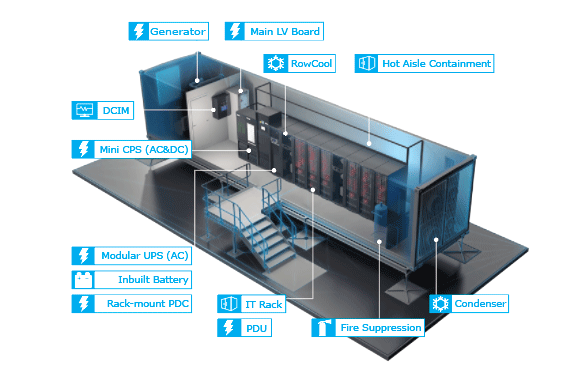

Instead of building a massive warehouse with centralized pump rooms and giant UPS halls, engineers take all the critical infrastructure—IT load, cooling, and power—and miniaturize it to fit inside a standard, weatherproof steel ISO shipping container.


### The "Data Center in a Box"

A containerized data center is essentially a highly dense, fully functional micro-facility. Inside a single container, you will find tightly integrated versions of every system required to keep servers running:

- **IT Load:** The center of the container holds standard 19-inch racks packed with thousands of servers.

- **Integrated Cooling:** Instead of massive perimeter CRAH units, cooling is pushed directly into the racks. These containers utilize strict Hot Aisle Containment, sealing the hot exhaust air into a central corridor. In-row cooling units (air conditioners built directly into the rack row) absorb this heat and exhaust it through a condenser mounted to the outside of the container.

- **Integrated Power:** There is no centralized electrical room. A modular UPS system, inbuilt battery arrays, and a Low Voltage (LV) distribution board are housed in the front vestibule of the container. Power is fed directly to the rack-mounted PDUs.

- **Emergency Backup:** A dedicated external diesel generator sits just outside the container to provide isolated emergency power.


### The "Rip and Replace" Philosophy

The modular approach fundamentally changes how data centers are built and maintained:

- **Rapid Deployment:** When a cloud provider needs to expand capacity, they do not need to construct a building or run miles of under-floor cabling. They simply pour a concrete slab, drop these pre-built, pre-tested containers onto the slab, connect utility power and water lines, and instantly bring thousands of servers online.

- **Disposable Hardware:** The most radical shift is the maintenance model. In a traditional data center, if a server breaks, a technician walks onto the floor, opens the rack, and replaces the part. In a hyperscale container deployment, the entire container is often treated as a disposable, commodity component.

- **Controlled Degradation:** If a few servers die inside the container, they are often ignored. Software automatically routes traffic to the healthy servers. The hardware is allowed to slowly fail over a period of years. Once a specific percentage of the servers in the container have died, a semi-truck arrives, unplugs the entire shipping container, hauls it away to be recycled, and drops a brand new, fully loaded container in its place.
