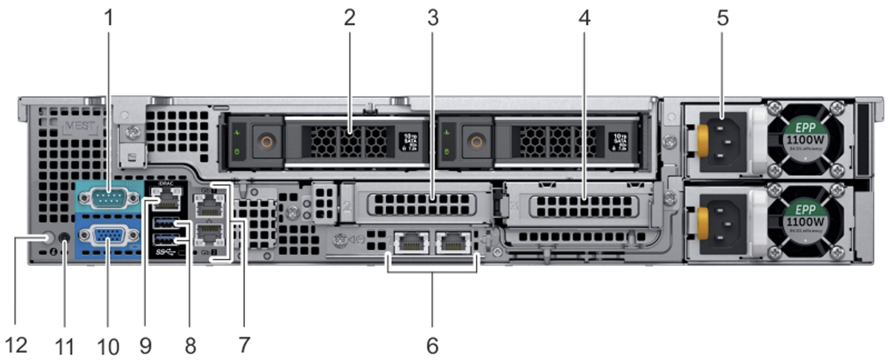
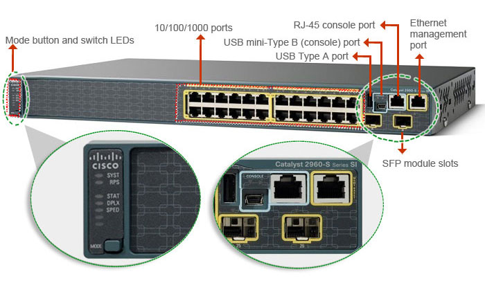
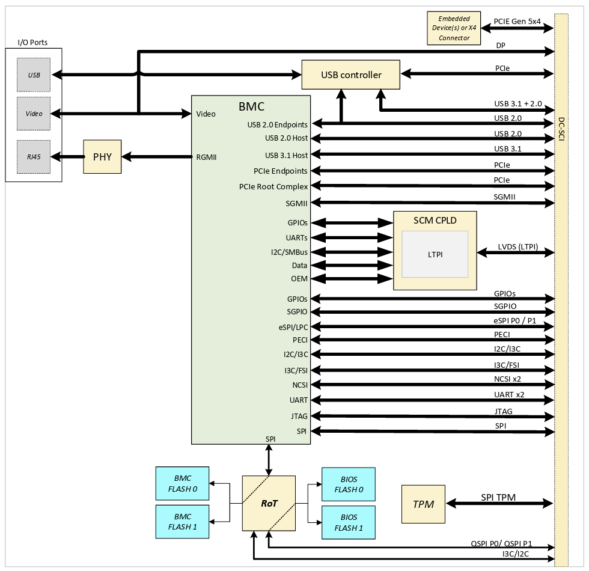
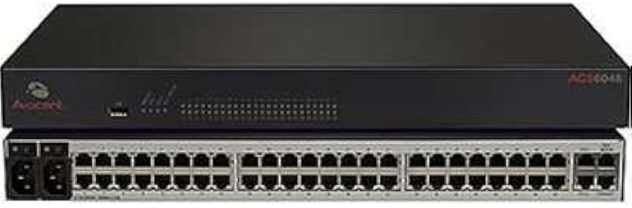
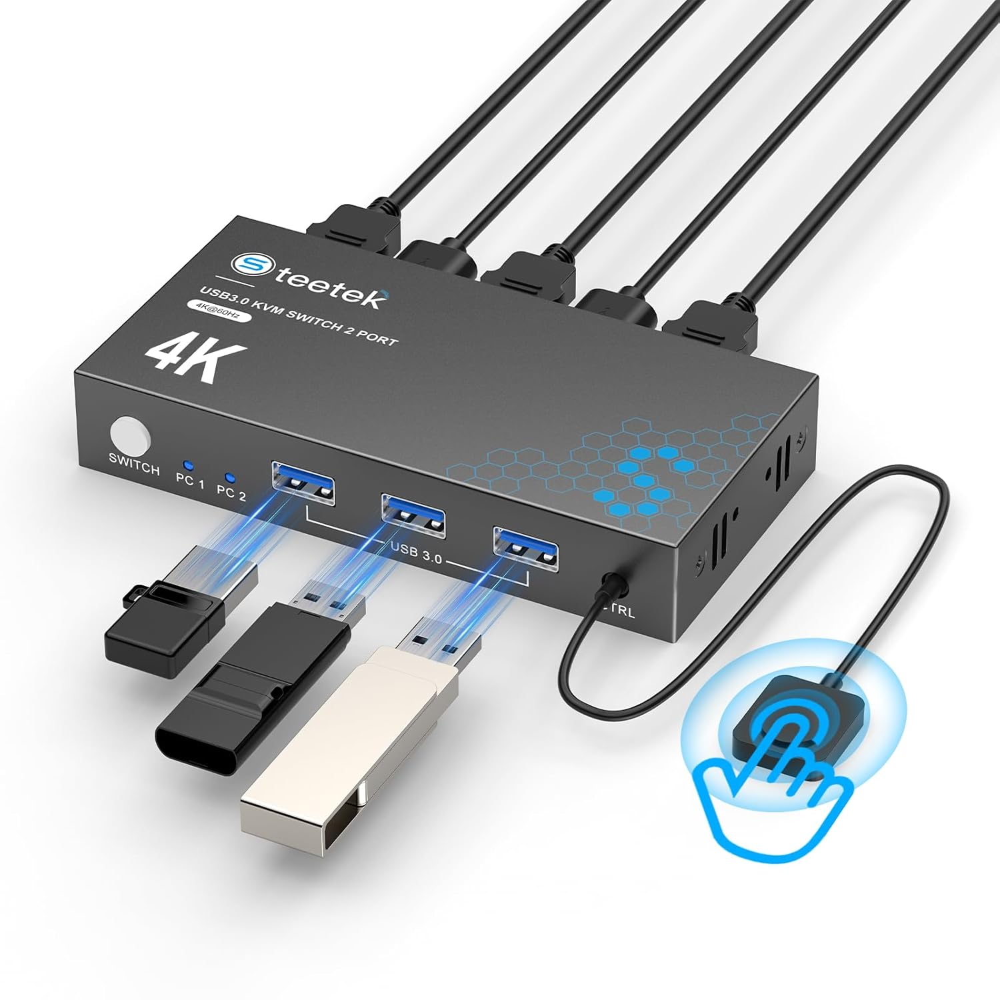
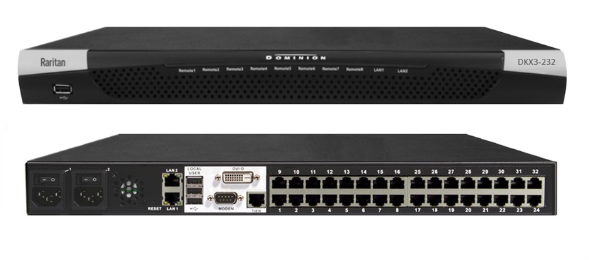

# Data Center Infrastructure Management

Infrastructure management is how IT administrators monitor, configure, update, and fix the physical hardware (servers, routers, switches) in a data center. To manage this equipment, administrators use two completely different methodologies: In-Band and Out-of-Band (OOB) management. Understanding the difference between these two is critical to understanding how data centers are wired.

## In-Band vs. Out-of-Band Management

**In-Band Management**

In-Band management means you are accessing the server or switch using the main production network. The exact same network the device uses to serve web pages, route internet traffic, or process data. You log into a functioning server using standard tools like SSH or Remote Desktop (RDP). It is highly dangerous to rely only on In-Band management. If the network crashes, a firewall rule blocks traffic, or the server's operating system freezes, you are entirely locked out of the machine you need to fix.

**Out-of-Band (OOB) Management**

OOB management is a fail-safe. It relies on a completely separate, physically isolated network built specifically for IT administrators. OOB interacts directly with the hardware itself (the motherboard, BIOS, or serial console) rather than the operating system. Even during catastrophic software crashes, power failures, or major network outages, administrators can still reach the equipment to fix the issue.

## The Management Network

To make Out-of-Band management possible, data centers build a Management Network. This is a parallel, low-bandwidth network designed exclusively as an administrative backdoor. Instead of plugging their management tools into the server's high-speed data ports, administrators plug into specialized, dedicated ports on the back of the hardware.

### Server Management Ports

When looking at the back of an enterprise server, you will see a mix of production data ports and OOB management ports. It is important to know the difference. Let us look at the "Dell EMC PowerEdge R540" server.

| Number | Component Name                | Short Description                                                                                                                                           |
| ------ | ----------------------------- | ----------------------------------------------------------------------------------------------------------------------------------------------------------- |
| 1      | Serial port                   | A legacy RS-232 connection used for direct, raw text-based console access (often connected to a Console Server).                                            |
| 2      | Drive (rear)                  | Optional rear-mounted hot-swappable storage drive bays.                                                                                                     |
| 3      | Low profile riser right slot  | A PCIe expansion slot designed to fit half-height (low profile) add-in cards on the right side.                                                             |
| 4      | Low profile riser left slot   | A PCIe expansion slot designed to fit half-height (low profile) add-in cards on the left side.                                                              |
| 5      | Power supply unit (PSU)       | The hot-swappable, redundant power supplies that provide electricity to the server hardware.                                                                |
| 6      | LOM riser ports               | LAN on Motherboard (LOM) ports, providing the primary built-in network interfaces for production traffic.                                                   |
| 7      | Ethernet ports                | Standard NIC ports for additional data network connectivity.                                                                                                |
| 8      | USB 3.0 ports                 | High-speed ports used for connecting external peripherals, such as a local keyboard and mouse (often via a KVM).                                            |
| 9      | iDRAC9 dedicated network port | The dedicated Out-of-Band (OOB) management port that connects directly to the server's Baseboard Management Controller.                                     |
| 10     | VGA port                      | A standard video output port for connecting a local monitor or crash cart to view the console.                                                              |
| 11     | CMA power port                | A connection point specifically for powering an active Cable Management Arm, if installed.                                                                  |
| 12     | System identification button  | A button with an integrated LED used to visually highlight and locate this specific server in a dark, crowded data center rack.                             |

**Out-of-Band Management Ports**

- Dedicated Ethernet Management Port: This looks like a standard network port, but it is wired directly to a Baseboard Management Controller (BMC) - a tiny, independent microcomputer built onto the motherboard. Because the BMC runs on standby power, it is awake the moment the server is plugged into the wall, even if the server is turned off. It allows admins to remotely power cycle the machine, check temperatures, or reinstall the OS via a web browser. Dell brands their BMC interface as iDRAC and HP brands theirs as iLO.

- Serial Port: This is a legacy, raw hardware-level port (RS-232). It provides direct, low-level text access to the device's command line. It is essential for "bare metal" recovery when a system is fresh from the factory with no IP address, or if it is stuck in a boot loop.

**The Production Data Ports**

- Standard Ethernet Ports: These are permanently soldered network interfaces built directly into the motherboard, providing baseline 1 Gbps connections.

- LOM Riser Ports: LOM stands for LAN on Motherboard. While LOM generically refers to any network interface integrated into the motherboard, Dell PowerEdge servers implement it as a proprietary, modular riser slot. This allows administrators to swap in network upgrades (like 10GbE or fiber modules) without consuming a standard PCIe expansion slot.

### Switch and Router Management Ports

Just like servers, network switches and routers separate their management traffic from their user data traffic. In modern high-performance and open networking switches, out-of-band management is handled through a combination of physical ports and internal controllers:

**The Console Port (Local, Physical Access)**

The console port is the ultimate "bare-metal" emergency access point. It is a serial connection that requires you to physically plug a cable from a laptop (or a dedicated Console Server) directly into the switch. It does not use an IP address or Ethernet. Because it is a direct serial connection, you can watch the device boot up live, interact with the ROM, or recover a switch that has completely wiped its own network configuration.

**The Dedicated Management Port (Remote, Network Access)**

Often labeled as MGMT or marked with a wrench icon, this is a standard Ethernet port that connects directly to the switch's control plane, completely isolated from the data-forwarding ports. You plug this port into your isolated Management Network, assign it an IP address, and you can securely configure the switch from anywhere in the world using SSH or a Web GUI. Traffic entering this port goes straight to the switch's CPU for admin tasks only. Even if your main production network is suffering from a broadcast storm, your SSH session on the management port remains stable.

**The Baseboard Management Controller (BMC)**

Not all switches have a BMC. Many 1U open networking switches have no BMC at all. On these platforms, all platform management (fan speed control, thermal monitoring, PSU status, LED state) is handled by CPLDs on the management board, accessed over I2C from the main CPU running the NOS. If the NOS crashes or the CPU hangs, there is no independent controller to monitor thermals or initiate a safe shutdown; the CPLDs continue driving fans at their last commanded speed, but there is no intelligent failsafe beyond that.

Newer and higher-end open networking switches do include a BMC for low-level hardware control. The BMC is an independent microcontroller that runs on standby power. It allows administrators to monitor temperatures, control fan speeds, cycle the power supply, or reinstall the switch OS via virtual media, even if the main switch CPU is powered down or locked up.

On some modular switches, the BMC has its own dedicated physical port. However, on most dense 1RU switches that include a BMC, it shares the standard Management (MGMT) port using the NC-SI (Network Controller Sideband Interface) protocol. The single physical cable accepts traffic for both the Switch OS and the BMC, with the NIC firmware routing incoming frames internally based on their destination MAC addresses.

| Feature              | Console Port                                  | Dedicated Management Port (OOB)              | BMC Port (Dedicated or NC-SI Shared)                                       |
| -------------------- | --------------------------------------------- | -------------------------------------------- | -------------------------------------------------------------------------- |
| Presence             | Standard on all switches.                     | Standard on all switches.                    | Not universal. Absent on many 1U switches (e.g., DX010); present on newer platforms (e.g., DX030). |
| Primary Use Case     | Initial setup, password recovery, OS failure. | Daily remote administration, config backups. | Hardware monitoring, remote power cycling, low-level recovery.             |
| Connection Type      | Serial (RJ-45, DB9, or USB).                  | Ethernet (RJ-45).                            | Ethernet (RJ-45).                                                          |
| IP Address Required? | No.                                           | Yes.                                         | Yes.                                                                       |
| Access Method        | Physical proximity (or a Console Server).     | Remote network access.                       | Remote network access.                                                     |
| Protocol             | Raw Serial / Asynchronous text.               | SSH, HTTPS, SNMP, TFTP.                      | Redfish, IPMI, HTTPS, SSH.                                                 |
| Availability         | Requires the device to be powered on.         | Only when Switch OS is booted.               | Available as long as the switch is plugged into power (even if OS is off). |
| Speed                | Very slow (Up to 115,200 bps).                | Fast (10/100/1000 Mbps).                     | Fast (10/100/1000 Mbps).                                                   |

## BMC Network Communication Protocols

Having a Baseboard Management Controller (BMC) connected to the Management Network is only useful if administrators and automated systems have a standardized way to communicate with it. Regardless of whether the BMC is embedded in an enterprise server or a top-of-rack switch, it generally listens for commands using different protocols.

### SNMP (Simple Network Management Protocol)

While SNMP is the oldest protocol on this list, it is still heavily used by centralized monitoring dashboards (like SolarWinds, Datadog, or Zabbix). Queries from a monitoring server to the BMC use UDP Port 161, while the BMC sends unsolicited "SNMP Traps" back on UDP Port 162 the second a power supply fails or a chassis intrusion switch is triggered, allowing monitoring systems to page an administrator instantly. While SNMP is fantastic for sending simple, automated alerts, it is terrible for complex configuration or interactive troubleshooting. If a server goes down, you cannot effectively "log in" and fix it using only SNMP. Administrators needed a way to interact with the hardware visually.

### HTTPS (The Web GUI)

To provide rich, interactive management, BMCs began hosting standard web servers on Port 443. If you type the BMC’s IP address into a standard web browser (like Chrome or Firefox), you will be greeted by a full Graphical User Interface (GUI). This dashboard allows human administrators to visually click through temperature graphs, view hardware logs, configure storage arrays, and even launch a virtual KVM (Keyboard, Video, Mouse) console directly in their browser. Web GUIs are great for humans, but terrible for bulk administration. If you need to change a BIOS setting on 1,000 servers, you cannot pay an administrator to manually click through 1,000 web pages. Engineers needed a fast, text-based way to configure hardware.

### SSH (The Management Shell)

If you prefer the command line, you can use SSH (Port 22) to connect directly to the BMC's IP address. Instead of logging you into the main server OS (like Windows or Linux), this logs you into a specialized, lightweight shell running specifically on the BMC. From here, you can execute commands to configure the hardware, force reboots, or reset forgotten passwords in seconds without waiting for a graphical interface to load. SSH shells suffered from massive vendor lock-in. The command to reboot a Dell server via SSH (racadm) was completely different from the command used on an HP or Supermicro server. Data centers with mixed hardware could not write a single, unified script to manage their racks. The industry desperately needed a vendor-neutral standard.

### IPMI (Intelligent Platform Management Interface)

Introduced by a coalition of hardware vendors (Intel, HP, NEC, Dell), IPMI became the universal legacy standard for bare-metal hardware management. Operating over UDP (Port 623), it relies on a binary, message-based protocol. Instead of vendor-specific SSH commands, administrators could use a single, standardized command-line utility (`ipmitool`) to query temperatures or force reboots across any brand of server in their data center.

As data centers scaled into the modern cloud era, IPMI began showing its age. Its underlying security architecture is considered weak by modern standards (often requiring it to be disabled entirely in strict environments). Furthermore, if you want to write an automated Python script, parsing the messy, raw text output of `ipmitool` is notoriously tedious and prone to breaking.

### Redfish

Created by the Distributed Management Task Force (DMTF), Redfish is the modern standard designed specifically to replace IPMI and bring hardware management into the cloud-computing era. Instead of cryptic binary messages and messy text outputs, Redfish is a standard RESTful API that operates securely over HTTPS (Port 443). It formats all hardware data such as temperature readings, fan speeds, and power states into clean, readable JSON. Because it uses standard web technologies, Redfish is highly secure and incredibly programmable, making it the perfect tool for engineers building out modern network telemetry pipelines or automated infrastructure deployments.

> **Note:** Both the Redfish API and the browser-based Web GUI share the same HTTPS service on port 443. They are typically served by the same web server on the BMC but at different URL paths — Redfish responds to RESTful API calls (e.g., `/redfish/v1/`), while the Web GUI serves the interactive browser dashboard.

| Protocol | Transport     | Primary User         | Data Format & Use Case                                                                                                                                                                                                        |
| -------- | ------------- | -------------------- | ----------------------------------------------------------------------------------------------------------------------------------------------------------------------------------------------------------------------------- |
| Redfish  | TCP (443)     | Scripts / Automation | The Modern Standard: A RESTful API over HTTPS that outputs clean JSON data. It is highly secure and incredibly easy to use for building automated telemetry pipelines or custom management scripts.                           |
| IPMI     | UDP (623)     | Legacy Systems       | The Legacy Standard: Introduced in 1998, it relies on a binary, message-based protocol using tools like ipmitool. It is universally supported but showing its age due to weaker security and difficult-to-parse text outputs. |
| HTTPS    | TCP (443)     | Human Admins         | The Web GUI: If you type the BMC's IP into a web browser, it loads a full visual dashboard to view hardware logs, click through temperature graphs, or launch a virtual KVM console.                                          |
| SSH      | TCP (22)      | Human Admins         | The Management Shell: Logs you into a specialized, lightweight command-line interface running specifically on the BMC for fast hardware configuration and power commands.                                                     |
| SNMP     | UDP (161/162) | Monitoring Tools     | Automated Alerts: Used by dashboards (like Datadog or SolarWinds) to receive instant "traps" (alerts) if a hardware component like a power supply fails.                                                                      |

## The Evolution of OOB Hardware: DC-SCM

Before a server's main operating system even loads, a separate, parallel system is already running to monitor, secure, and manage the hardware. It relies on several specialized chips:

- **Baseboard Management Controller (BMC)**: The central brain of server management. It allows administrators to remotely power cycle the server, monitor temperatures, and update firmware regardless of whether the main CPU is functioning.

- **Hardware Root of Trust (RoT)**: A dedicated security processor. It cryptographically verifies that the BMC's firmware is authentic and unaltered before the system is allowed to boot, preventing hardware-level hacks.

- **Trusted Platform Module (TPM)**: A secure cryptoprocessor or vault that safely stores cryptographic keys, digital certificates, and boot process measurements required for compliance.

Historically, all of these OOB management chips (the BMC, RoT, and TPM) were permanently soldered directly onto the server's main motherboard, alongside the primary compute processors (CPUs/GPUs). This tightly coupled, monolithic design created three significant bottlenecks for data centers:

- **Hardware Waste**: Whenever a data center needed to upgrade to a faster CPU, they had to throw away the entire motherboard, including the perfectly functional management and security chips.

- **Slow Development Cycles**: Because the management chips and compute chips shared a single physical board, engineers could not innovate on the BMC without waiting for the main motherboard's development cycle to finish.

- **Exploding Complexity**: As data centers began using a diverse mix of x86 processors, ARM chips, and AI accelerators, administrators were forced to validate and manage different security paradigms for every single hardware configuration.

To solve these inefficiencies, the Open Compute Project (OCP) created the **Data Center Secure Control Module** (DC-SCM). Instead of soldering the management chips onto the main motherboard, DC-SCM moves the BMC, RoT, TPM, and all physical OOB ports (Management Ethernet, USB, Video) onto a standardized, physical plug-in card. You can think of the DC-SCM as a miniature, specialized motherboard dedicated entirely to security and control. It connects to the main motherboard - now referred to as the **Host Processor Module** (HPM) - using a standardized interface called the **DC-SCI** (Data Center Secure Control Interface).

By physically separating the management brain from the compute muscle, data centers unlock several critical advantages:

- **Decoupled Innovation**: Engineers can develop, test, and deploy new security modules independently of the main server board. If a company wants to switch to a different BMC vendor, they simply plug in a new DC-SCM card.

- **Universal Consistency**: A data center can use the exact same standardized DC-SCM card across all their servers, whether that server is running standard web applications on x86 or training machine learning models on custom GPUs.

- **Cost Reduction**: By removing complex management routing and expensive PCB material from the main motherboard, the HPM becomes simpler and cheaper to manufacture.

- **Compliance Customization**: Standardized connectors on the DC-SCM allow administrators to plug in the exact TPM version (e.g., 1.2 or 2.0) required by their specific organizational policies without requiring a custom motherboard order.

Because server chassis designs vary, the DC-SCM standard supports different physical form factors to accommodate diverse hardware setups:

- **Vertical Form Factor**: Often used by organizations like Google, this module plugs in vertically and extends to the front panel, saving the more expensive main motherboard material from needing to stretch all the way to the front of the server chassis.

- **Horizontal Form Factor**: Used by organizations like Microsoft, this is a coplanar module that plugs into the edge of the motherboard (straddle mount), providing a flatter profile for specific rack designs while still exposing front-accessible ports and LEDs.

For a visual walkthrough, see these overviews of [DC-SCM 1.0](https://youtu.be/1hckYgq8oTE) and [DC-SCM 2.0](https://youtu.be/ANgrfAuJhyU).

## Scaling Remote Access

In a data center with thousands of servers and hundreds of network switches, it is physically impossible to plug a crash cart or a laptop into every single device when something goes wrong. To solve this, the Management Network utilizes Console Servers and KVM over IP switches. These devices act as centralized hubs, aggregating individual physical connections so administrators can access them remotely from anywhere in the world. Because understanding these tools depends on knowing what kind of data they transmit, we will break them down by their specific access types: Text-based (CLI) vs. Visual (GUI).

| Feature                    | Console Server (Terminal Server)        | KVM over IP                                         |
| -------------------------- | --------------------------------------- | --------------------------------------------------- |
| Primary Target Devices     | Network Switches, Routers, Firewalls    | Servers, Storage Arrays, Workstations               |
| Interface Provided         | Command Line Interface (CLI) / Raw Text | Graphical User Interface (GUI) / Video              |
| Connection to Device       | Serial (RS-232 via RJ-45)               | Video (VGA/DisplayPort/HDMI) & USB                  |
| Network Bandwidth Required | Extremely Low (Text only)               | Moderate to High (Streaming Video)                  |
| Cellular Backup Capability | Very Common (due to low data needs)     | Rare (video streaming over cellular is costly/slow) |

### The Console Server (Terminal Server): Aggregating Serial Access

Network equipment (like Cisco routers, Juniper firewalls, or Arista switches) relies heavily on command-line interfaces (CLI). The ultimate "bare-metal backdoor" for these devices is the physical Serial Console Port.

A Console Server (sometimes called a Terminal Server) is a dedicated appliance designed to connect to the serial ports of dozens of different devices simultaneously. A typical Console Server has 16, 32, or 48 RJ-45 serial ports on the back, alongside standard Ethernet ports for network connectivity. Administrators run standard Cat5e/Cat6 cables (often pinned as "rollover" cables) from the Console Server's serial ports directly into the serial Console Ports of the surrounding network switches and servers.

**Operational Workflow and Port Mapping**

The Console Server connects to the isolated Management Network. When an administrator needs to fix a crashed router, they access the Console Server over the IP network. Console servers utilize a One-to-One Mapping system, where each physical serial port on the appliance corresponds to a specific, unique TCP port number. Administrators can access these ports directly via:

- **Telnet** (Direct TCP Access): Connecting to the console server's IP address on a specific alias port routes you directly to a specific device. For example, connecting to 10.10.10.2 on Port 7001 drops you into Physical Port 1. Port 7002 routes to Physical Port 2, and so on.

- **Reverse SSH** (Modern Secure Access): For encrypted connections, modern console servers support what vendors call Reverse SSH — not to be confused with SSH reverse tunneling, but rather an SSH connection to a specific TCP port that maps directly to a serial channel. Running a command like `ssh -p 2010 admin@10.10.10.2` provides secure, direct access to the serial console of Device 1.

**Shared vs. Exclusive Sessions**

Many console servers default to an exclusive (single-session) mode to prevent conflicting commands. The appliance enforces one controlling session per serial channel. If one administrator is logged into a device via the console server and a second attempts to connect to the same mapped port, the second user will receive a session lock rejection.

Imagine you are connected to a device using telnet:

    telnet 10.10.10.2 7010

A second user attempting:

    telnet 10.10.10.2 7010

will receive a session lock rejection similar to:

    Trying 10.10.10.2...
    Connected to 10.10.10.2.
    Escape character is '^]'.

    This connection is in use. User(s) currently connected: mamoozadeh@441.
    You need privilege to make a simultaneous session.
    The connection was unsuccessful.
    Connection closed by foreign host.

Administrators can explicitly enable shared sessions within the appliance's CLI configuration, allowing multiple operators to attach to the same device console channel and observe identical live output simultaneously.

**Key Benefits and Use Cases**

Because engineers are dropped into the raw, text-based serial feed of the device, Console Servers provide unique advantages:

- **OS Independence & Recovery**: Engineers can configure, troubleshoot, or recover devices even during critical failures—such as when a switch is unresponsive ("hung"), boot-looping, network-isolated, or requires a password reset due to corrupted configurations.

- **Crash Analysis**: Admins can observe raw boot output, BIOS menus, and kernel panics that simply are not visible or broadcasted over standard network connections.

- **Initial Provisioning**: They allow for the initial configuration of factory-new devices (like ONIE installers) that do not yet have an IP address assigned.

- **Low Bandwidth**: Serial data is just raw text, meaning it requires almost zero network bandwidth to operate smoothly.

- **Cellular Failover**: Because it uses little data, modern Console Servers often have built-in 4G/5G cellular modems. If the data center's main internet line is entirely severed, admins can securely dial into the Console Server over cellular networks to rebuild the routing tables.

### KVM (Keyboard, Video, Mouse): Aggregating Visual Access

While serial access is perfect for managing command-line network equipment, servers running full operating systems (like Windows Server or GUI-based Linux distributions) often require visual interaction. To interact visually with a system at the hardware layer, administrators rely on a Keyboard-Video-Mouse (KVM).

A KVM system is a hardware or software layer that allows you to control multiple computers or servers from a single keyboard, monitor, and mouse. Instead of having separate peripherals cluttering a desk or a server rack, a KVM creates a centralized switching layer. It takes your single set of peripherals and forwards their inputs and video outputs to whichever computer you currently have selected.

| KVM Type            | Works when OS is down? | Has video streaming?                | Network capable?                    |
| ------------------- | ---------------------- | ----------------------------------- | ----------------------------------- |
| Physical KVM switch | Yes                    | Yes (local monitor cable)           | No                                  |
| KVM over IP         | Yes                    | Yes (compressed video over network) | Yes                                 |
| Software KVM        | No                     | No                                  | Yes (LAN required for input events) |

**Physical KVM Switches (The Hardware Foundation)**

A physical KVM switch is a hardware device that electronically switches your peripherals between multiple local computers. All the target machines have cables plugged directly into the KVM unit simultaneously.

Because a physical KVM operates purely at the hardware layer—sitting completely outside of the operating system—it provides unparalleled low-level access. You can control computers while they are booting, interact with the BIOS, or fix a machine stuck on a kernel panic. Switching between machines is generally triggered by a physical button on the unit or a keyboard hotkey (e.g., hitting Scroll Lock twice, followed by a number).

While perfect for a home lab, a server rack, or an IT desk, physical KVMs have a major limitation: the user must be physically standing in front of the switch, limited by the length of standard video (VGA/HDMI/DisplayPort) and USB cables.

**KVM over IP (The Data Center Standard)**

To bring hardware-level visual access to massive data centers, engineers took the physical KVM switch and added a network digitization layer, creating KVM over IP. KVM over IP is a network-enabled, out-of-band remote access system. It captures the actual video framebuffer signal from a remote machine, compresses it using a dedicated chip, and streams it securely over the management network to an administrator located anywhere in the world. Simultaneously, it emulates USB inputs, tricking the remote server into believing a real, physical keyboard and mouse are plugged into it.

- **The Edge Connection**: The KVM switch connects to the servers using special dongles, often called Server Interface Modules or Computer Interface Modules (CIMs). These plug directly into the server’s VGA/DisplayPort and USB ports.

- **The Digitization**: The CIM captures the video signal (analog VGA or digital DisplayPort) and USB input data, digitizes it, and tunnels it over standard Ethernet cabling (Cat5/6 UTP) back to the central KVM over IP appliance (like a Raritan Dominion).

- **The Remote Access**: Administrators log into the KVM switch's web interface. They are presented with a graphical window displaying the live, pre-OS video feed of the server, allowing them to remotely interact with the BIOS, mount virtual ISOs to reinstall operating systems, or fix bootloader failures.

> The 32 RJ-45 ports on an appliance like the Dominion DKX3-232 pictured above are not serial ports; they are dedicated ports for the [CIM dongles](https://www.raritan.com/products/kvm-serial/accessories/computer-interface-modules) tunneling compressed video and USB data.

Modern BMCs have largely absorbed the role of the KVM by offering built-in virtual console features directly on the motherboard. However, traditional KVM over IP appliances are still actively used to:

- **Centralize Management**: They provide a single interface to manage older, heterogeneous hardware that lacks dedicated or reliable OOB ports.

- **Reduce Licensing Costs**: Many server vendors charge expensive, recurring enterprise license fees to unlock the remote video console feature on a BMC. A centralized KVM provides a one-time hardware cost to achieve the exact same result across dozens of servers.

- **Enforce Security Air-Gapping**: In highly classified or secure environments, administrators may mandate that BMCs be physically disabled to ensure zero direct network access to the motherboard’s management chip, relying entirely on external, independent KVM over IP switches for console access.

**Software KVM (The OS-Dependent Layer)**

A Software KVM is a local-area network (LAN) based sharing system that runs as an application on top of an operating system. Unlike a physical KVM or KVM over IP, it does not switch real monitor cables, nor does it sit outside the OS. Instead, a background daemon forwards keyboard and mouse input events over the network, allowing a user to seamlessly drag their mouse cursor across the screens of multiple distinct computers.

This is built entirely for convenience (such as a developer managing multiple PCs on a single desk) rather than infrastructure management. Because it relies on the operating system's network stack, it cannot be used for bare-metal recovery. If a machine's OS crashes or fails to boot, a Software KVM is entirely useless. Popular examples include:

- Synergy (a commercial, cross-platform system for sharing a single mouse and keyboard)
- Barrier (an open-source Synergy fork)
- Universal Control (built into Apple devices)
