# Network Topology

This document covers the physical and logical topology of a data center network. Physical topology describes how hardware is physically cabled together — the rack-level wiring models and the infrastructure zones where equipment lives. Logical topology describes how traffic actually flows through the network — the overarching architectural blueprints (Three-Tier, Leaf-Spine, Fat-Tree, Dragonfly) and the forwarding mechanisms that distribute load across the fabric.

## Physical Topology: Connecting the Hardware

Once you have a rack full of servers, the question becomes: How do we connect them? This is where the Physical Topology (where the cables physically go) meets the Logical Topology (how the data flows).

Let's look at how the racks are wired. To understand the different physical layouts, we first need to define the standard zones where equipment lives (based on the `TIA-942` standard) and the physical limitations of the cables connecting them.

### The Infrastructure Zones

- **EDA** (Equipment Distribution Area): The compute layer. These are the standard racks filled with your servers and storage arrays.

- **HDA** (Horizontal Distribution Area): The aggregation layer. This is a dedicated network rack that houses the switches managing traffic for a specific row or zone of servers.

- **MDA** (Main Distribution Area): The core of the data center. It houses the primary routers and core switches. It is the central nervous system.

### The Cabling Constraints

The physical architecture you choose is largely dictated by cable limitations:

- **Copper Cable**: Inexpensive, but distance-limited and heavy. If bundled too thickly, it can block rack airflow. Used primarily for connecting servers to their immediate switches.

- **Fiber Cable**: More expensive, but can travel vast distances without signal degradation. It is much thinner, allowing for better airflow. Used for high-speed uplink connections back to the core.

### Top-of-Rack (ToR) Switching

ToR is the dominant wiring model in modern cloud and AI clusters. Every server rack gets its own dedicated network switch—or more commonly, a pair of switches for reliability—typically mounted at the very top.

- **Downlink Ports** (Server-Facing): The servers in the rack plug directly into this ToR switch using short, inexpensive copper cables (like Direct Attach Copper, or DAC). Because a single server in a general-purpose environment typically generates less traffic than the aggregate of the entire rack, these ports run at a lower speed than the uplinks (e.g., 10 Gbps or 25 Gbps per server port, though AI servers commonly use 100 Gbps or 400 Gbps).

- **Uplink Ports** (Network-Facing): The ToR switch combines all the traffic from those servers and sends it out to the rest of the data center. To prevent a traffic jam, these uplinks use fiber optic cables and are much faster (100 Gbps, 400 Gbps, or even 800 Gbps).

As illustrated in the diagram below: The three server racks on the left each feature a dedicated ToR switch at the top. The short lines represent the localized copper downlinks connecting individual servers to their local switch. The longer blue lines represent the high-speed fiber uplinks, which gather the combined traffic from each rack and transport it to the central Aggregation Switch on the right.

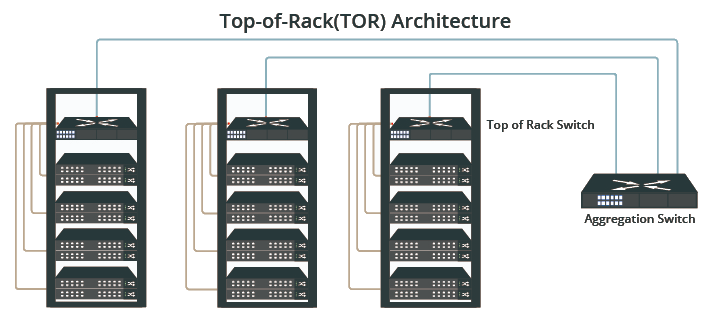

> Most Top-of-Rack (ToR) network switches are 1U tall, so you will often hear engineers refer to "pizza box switches."

In enterprise and AI environments, relying on a single ToR switch creates a Single Point of Failure (SPOF). To solve this, racks are outfitted with two ToR switches. Servers connect a port to each switch, allowing them to transmit data across both simultaneously. If one switch fails, experiences a power loss, or requires a reboot for a firmware patch, the second switch handles the traffic, ensuring the servers never drop off the network.

### Other Rack-Level Architectures

While ToR is the modern standard, there are other ways to physically wire a data center row.

Here is how the different architectures compare:

| Architecture        | Switch Location                                                             | Typical Cabling Route                                                           | Advantages                                                                                             | Disadvantages                                                                                                          |
| ------------------- | --------------------------------------------------------------------------- | ------------------------------------------------------------------------------- | ------------------------------------------------------------------------------------------------------ | ---------------------------------------------------------------------------------------------------------------------- |
| Top-of-Rack (ToR)   | Inside every EDA (server rack), usually at the top.                         | Server to Switch: Short Copper. Switch to Core: Fiber.                          | Modular scaling (rack-by-rack); highly localized cable management; keeps copper runs extremely short.  | High cost (requires buying a switch for every single rack); many separate management points.                           |
| Middle-of-Rack      | Inside every EDA, mounted vertically in the middle.                         | Server to Switch: Short Copper. Switch to Core: Fiber.                          | Same as ToR, but balances and minimizes copper cable length for top and bottom-mounted servers.        | Takes up prime, eye-level server space right in the middle of the rack.                                                |
| Middle-of-Row       | Dedicated HDA (network rack) placed in the physical center of a server row. | Server to Switch: Medium Copper via overhead trays. Switch to Core: Fiber.      | Centralized management; fewer switches to buy; shorter maximum copper runs compared to End-of-Row.     | Heavy cable bundles entering the center rack; a switch failure takes out half the row.                                 |
| End-of-Row (EoR)    | Dedicated HDA (network rack) placed at the far end of a server row.         | Server to Switch: Long Copper via overhead trays. Switch to Core: Fiber.        | Centralized network management at the aisle ends; easiest hardware access for network engineers.       | Massive overhead cable bundles; longest copper runs; a switch failure takes out the entire row.                        |
| Centralized Cabling | Only in the core/Main Distribution Area (MDA).                              | Server to Core: Very long copper via overhead trays. (No fiber used in the row) | Ultimate centralized management; requires buying only massive core switches rather than edge switches. | "Cable spaghetti"; massive weight on cable trays; restricted data center airflow; strictly limited by copper distance. |

> The acronym "MoR" is often a source of confusion because it is used interchangeably for two entirely different layouts: Middle-of-Rack (where a switch goes inside a server rack) and Middle-of-Row (where a dedicated network rack sits in the center of an aisle).

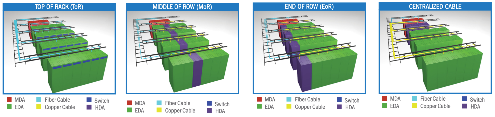

## Key Networking Concepts (The Prerequisites)

To understand why modern data centers are wired the way they are, you must understand two critical concepts: Traffic Direction and Subscription.

### Traffic Direction

Traffic direction in a data center describes the path data takes to get to its destination. It could be categorized as **North-South** and **East-West** traffic. These terms come from how network engineers traditionally draw network diagrams: the Internet is at the top (North), the core network is in the middle, and the servers are at the bottom (South).

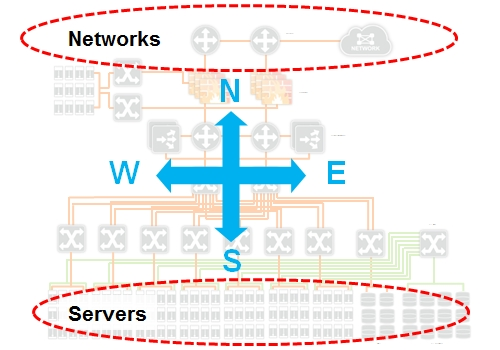

Historically, most network traffic was **North-South**, meaning it traveled between the end user out on the internet and the servers inside the data center. However, modern cloud applications and large-scale AI training have shifted this paradigm. Today, up to 99% of data center traffic is **East-West**, which refers to data moving laterally between servers, databases, and storage arrays within the same facility. Because modern apps are broken down into hundreds of specialized microservices, and AI requires thousands of GPUs to constantly share calculations billions of times a second, massive amounts of data must move sideways to coordinate before a final answer is ever sent back North to the user.

- **North-South**: Traffic leaving the data center to the internet (Users $\leftrightarrow$ Servers).
- **East-West**: Traffic moving between servers inside the data center (Server $\leftrightarrow$ Server).

### Subscription

Subscription is all about dealing with bottlenecks. It is the balance between the maximum speed of the connected servers and the size of the uplink connecting that switch to the rest of the network.

To see this in hardware, consider a physical switch like the [Cisco Catalyst C9300L-48P-4G](https://www.cisco.com/c/en/us/products/collateral/switches/catalyst-9300-series-switches/nb-06-cat9300-ser-data-sheet-cte-en.html). This specific model features 48 standard 1-Gigabit ports for connecting end devices (a total inbound capacity of 48 Gbps). However, it only has 4 fixed 1-Gigabit uplink ports to forward that traffic out to the broader network (a total outbound capacity of 4 Gbps). If all 48 connected devices max out their connections at the exact same time, you have 48 Gbps trying to squeeze through a 4 Gbps pipe. This creates an **oversubscription** ratio of 12:1 (48 divided by 4).

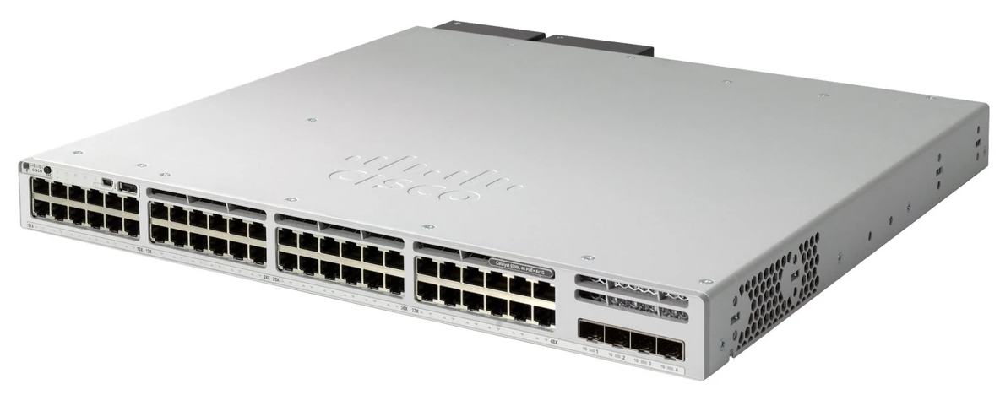

In a standard enterprise environment, networks are often built to be oversubscribed just like this. To use an analogy, if you have 1,200 cars in a neighborhood but the exit road only fits 100 cars at a time, you have that exact same 12:1 oversubscription ratio. This hardware design saves money and works perfectly fine for bursty, unpredictable traffic like emails or web browsing, because it is mathematically unlikely that every server will transmit data at 100% capacity at the exact same millisecond. If traffic demands do increase, network engineers might upgrade to a modular switch (like the standard C9300-48T), which allows them to swap those 4 Gbps uplinks for 10G or 25G modules, bringing the oversubscription ratio down to a more comfortable level.

However, High-Performance Computing and AI demand a **Non-Blocking** or 1:1 architecture. In this scenario, the exit road is built exactly as wide as it needs to be meaning a 48-port switch would need a full 48 Gbps of uplink capacity so every single server can transmit at full speed simultaneously without ever hitting a bottleneck. Because AI GPUs are incredibly expensive and must constantly synchronize their data together during training, any network congestion would force the hardware to sit idle while waiting for the network to clear. That downtime is an unacceptable waste of money and time, making a guaranteed, non-blocking network an absolute necessity for modern AI infrastructure.

## Logical Topology: The Evolution of the Network

With the physical hardware and core concepts understood, we can look at the "Logical Topology" - the overarching blueprint of how traffic moves.

### The Previous Generation: Three-Tier (Core-Aggregation-Access)

This was the classic enterprise design, built in the early 2000s when most traffic was North-South (users accessing web servers). It is structured like a family tree:

- **Access Layer (Layer 2 Switching):** The ToR switches that servers plug into. These operate primarily at Layer 2, performing MAC-based forwarding, VLAN assignment, and port security. Their job is high-density, low-cost connectivity for end devices — not routing decisions.

- **Aggregation (Distribution) Layer (Layer 2/3 Boundary):** Multiple Access switches plug into a pair of Aggregation switches. This is where Layer 3 routing begins. Aggregation switches handle inter-VLAN routing, enforce ACLs and QoS policies, and act as the policy boundary between the access edge and the core. Stateful services like firewalls and load balancers are typically inserted at this layer.

- **Core Layer (Layer 3 Routing):** The high-speed backbone. Core switches are pure Layer 3 routers optimized for maximum forwarding throughput with minimal latency. They carry no access policies, no ACLs, and no service insertion. Their sole responsibility is moving packets between aggregation blocks and out to the internet as fast as the silicon allows.

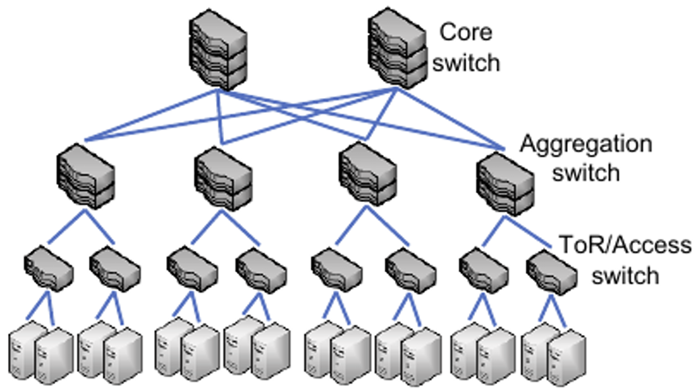

**The Fatal Flaws**

- **East-West Choke and Hairpinning:** In this model, an Access switch only talks to its assigned Aggregation switches. It does not talk to other Access switches. If Server A in Rack 1 wants to talk to Server B in Rack 2, the data must go: Access → Aggregation → Access. This inefficient routing path—where traffic travels up the network hierarchy only to be sent right back down to a nearby destination—is known as **hairpinning** (or tromboning). If Server B is in a different part of the building, it might even have to go all the way up to the Core. This creates massive bottlenecks and unpredictable latency for the server-to-server traffic that dominates modern data centers.

- **Redundant Links and Spanning Tree Protocol (STP):** In a production network, a single cable failure between an access switch and its aggregation switch would instantly disconnect every server on that switch. To protect against this, engineers run redundant links (multiple physical cables between the same pair of switches) so that if one link dies, traffic can failover to the surviving link without an outage.

    However, because the Access layer operates at Layer 2, these redundant links create a dangerous side effect: broadcast storms. When a switch receives a broadcast frame (like an ARP request), it floods the frame out every port except the one it arrived on. If two switches are connected by more than one link, each copy of the frame is forwarded back to the other switch on the parallel link, which floods it again, creating an infinite loop that saturates the network within seconds.

    STP was designed to prevent this by logically disabling redundant links, leaving only a single, loop-free forwarding path active at any time. The blocked links sit idle as standby — they only activate if the primary link fails and STP reconverges (a process that could take 30 to 50 seconds in the original standard). The result is that you paid for two cables, but one sat completely idle. This effectively cut your available bandwidth in half while also introducing reconvergence delays during failures.

- **No Fabric Load Balancing:** Because STP forces a single active path, there is no mechanism to spread traffic across parallel links. All traffic between two switches must traverse the single STP-elected forwarding path, regardless of how many physical links exist between them. Technologies like EtherChannel (link aggregation) could bundle multiple links into one logical pipe, but they only worked point-to-point between a pair of switches and did not solve the broader fabric-wide limitation imposed by STP's tree topology. For details on how modern networks handle this, see [Fabric Load Balancing](https://github.com/ManiAm/GNS-DC-Load-Balancing/blob/master/01_README_LB.md).

### The Modern Standard: Leaf-Spine (Clos Topology)

As Big Data and Cloud Computing arrived, East-West traffic exploded. Servers were constantly talking to each other. The old three-tier tree could not handle the volume, so the Leaf-Spine architecture was born to make networks flat, predictable, and incredibly fast.

**The Clos Network**

The Leaf-Spine topology is a practical implementation of the Clos network, a mathematical switching architecture invented by Charles Clos at Bell Labs in 1953. Clos originally solved a telephone exchange problem: how to connect any caller to any receiver without blocking, using many small, inexpensive switches instead of one impossibly large switch. The key insight is that if you arrange switches into stages and connect every switch in one stage to every switch in the next stage, you can guarantee that a non-blocking path always exists between any input and any output.

Data center engineers adopted the same principle. Instead of telephone circuits, the inputs and outputs are servers, and the switches are commodity network devices. The result is a fabric where every server can communicate with every other server at full bandwidth, using only small, identical switches arranged in stages.

**Two-Tier Leaf-Spine (3-Stage Clos)**

A standard Leaf-Spine fabric has two tiers of switches and maps directly to a 3-stage Clos network. The three stages are: the ingress leaf (stage 1), the spine (stage 2), and the egress leaf (stage 3). Traffic between any two servers on different leaves always traverses exactly three stages (leaf, spine, leaf) providing uniform, predictable latency.

- **Leaf Switches (Layer 2/3 Edge):** These are the ToR access switches. Every server connects to a Leaf. Leaf switches operate at both Layer 2 (local VLAN switching for servers in the same rack) and Layer 3 (routing traffic toward the spines). They are the first-hop gateway for servers and the enforcement point for ACLs, [VXLAN encapsulation](https://github.com/ManiAm/GNS-DC-VXLAN/blob/master/docs/02_vxlan.md), and policy in overlay-based fabrics.

- **Spine Switches (Layer 3 Fabric Core):** The backbone. Every Leaf switch connects to every Spine switch. Spines are pure Layer 3 forwarders. They carry no access policies, no ACLs, and no directly attached endpoints. Their job is maximum-throughput forwarding across the fabric.

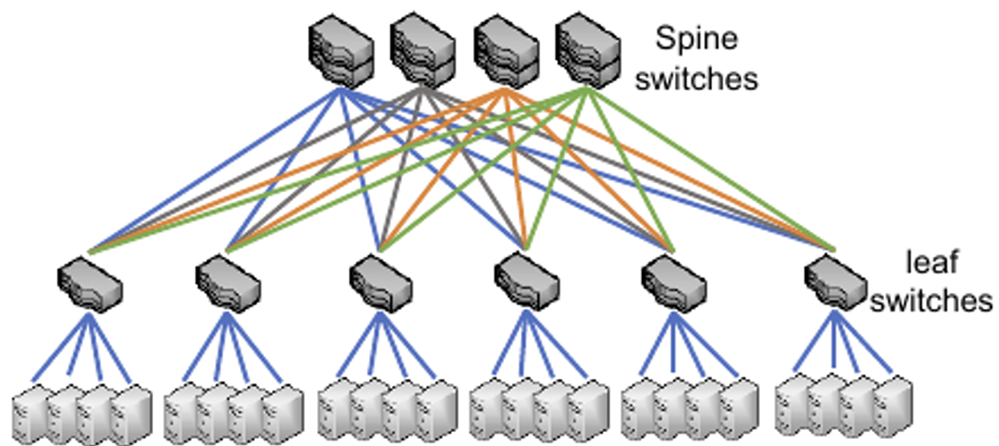

A two-tier Leaf-Spine fabric scales until the spine switches run out of ports. If you have 64-port spines and each spine port connects to one leaf, the fabric supports a maximum of 64 leaf switches. To go beyond this, you add a third tier.

**Three-Tier Leaf-Spine (5-Stage Clos)**

When a single set of spines runs out of ports, engineers add a Super-Spine layer above the spines, creating a 5-stage Clos network. The fabric is divided into **pods**, where each pod is a self-contained two-tier leaf-spine fabric. The super-spines interconnect the pods by connecting to every spine in every pod.

Traffic between servers in different pods traverses five stages: leaf → spine → super-spine → spine → leaf. Within the same pod, traffic still takes the shorter three-stage path (leaf → spine → leaf). This preserves the Clos guarantee (a non-blocking path exists between any two servers in the entire fabric) while scaling to tens of thousands of endpoints.

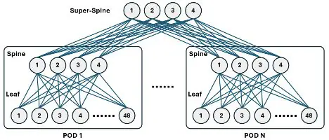

### Leaf-Spine Advantages

- **Predictable Latency (No Hairpinning):** No matter where Server A and Server B are located, they are always a fixed number of hops away: three in a two-tier fabric (Leaf $\rightarrow$ Spine $\rightarrow$ Leaf), or five across pods in a three-tier fabric. This eliminates the unpredictable latency of traffic hair-pinning up and down a three-tier tree.

- **Linear Scaling:** Need more bandwidth? Add another Spine switch. Need more servers? Add another Leaf switch. Need more pods? Add super-spines. You scale horizontally with commodity switches rather than buying massive, expensive chassis upgrades.

- **All Links Active (ECMP instead of STP):** Unlike three-tier networks that relied on Layer 2 Spanning Tree Protocol (STP) to shut down redundant links, a Leaf-Spine fabric operates primarily at Layer 3 using [Equal-Cost Multi-Path (ECMP)](https://github.com/ManiAm/GNS-DC-Load-Balancing/blob/master/01_README_LB.md#ecmp-equal-cost-multi-pathing) routing.

By 2026, the industry has entirely moved past the three-tier model in the data center. The conversation is now focused on optimizing Leaf-Spine for extreme throughput:

- **AI/ML Clusters:** The massive East-West data demands of training AI models (like LLMs) require zero-packet-loss, ultra-high bandwidth environments. Leaf-Spine is the only topology capable of supporting the massive GPU-to-GPU communication required.

- **800G and Beyond:** Data centers are deploying 800G optics at the Spine layer to prevent bottlenecks as server access speeds push past 100G and 200G.

### Common Hardware by Role

The table below maps network roles to the hardware platforms most commonly deployed in the industry. The three-tier topology is dominated by traditional enterprise vendors (Cisco and Juniper), while Leaf-Spine fabrics introduced Arista as a major force alongside open networking platforms.

| Role                        | Cisco         | Juniper    | Arista        | Open Networking  |
| --------------------------- | ------------- | ---------- | ------------- | ---------------- |
| **Three-Tier: Access**      | Catalyst 9300 | EX4300     | —             | —                |
| **Three-Tier: Aggregation** | Catalyst 9500 | EX4600     | —             | —                |
| **Three-Tier: Core**        | Nexus 9000    | QFX10000   | —             | —                |
| **Leaf-Spine: Leaf (ToR)**  | Nexus 9300    | QFX5120    | 7050X / 7060X | Edgecore (SONiC) |
| **Leaf-Spine: Spine**       | Nexus 9500    | QFX5220    | 7500R / 7800R | Edgecore (SONiC) |
| **Leaf-Spine: Super-Spine** | Nexus 9500    | QFX5230    | 7800R         | Edgecore (SONiC) |
| **WAN / DC Interconnect**   | Cisco 8000    | PTX Series | 7280R         | —                |

Arista is largely absent from the three-tier column because the company was founded in 2004 (as Arastra, Inc., rebranding to Arista Networks in 2008) specifically to build Leaf-Spine fabrics for cloud and hyperscale data centers. Its switches run EOS (Extensible Operating System), a Linux-based platform heavily favored for automation and programmability. The open networking column represents white-box switches running vendor-neutral operating systems like SONiC (Software for Open Networking in the Cloud), originally developed by Microsoft for Azure. The "WAN / DC Interconnect" row sits outside the data center fabric itself. These are service-provider-class routers that handle BGP full tables, long-haul transport between data center sites, and peering at internet exchange points.

### Beyond Pods: The Block-Based Clos (Hyperscale)

The pod model works well when each pod is a simple two-tier fabric (leaves + spines) and a single super-spine tier interconnects them. But at hyperscale (tens of thousands of switches serving hundreds of thousands of servers), even the super-spine tier runs out of ports. Engineers solve this by adding more tiers, but the simple "leaf / spine / super-spine" naming breaks down once you have four, five, or more layers of switches.

To manage this complexity, hyperscale operators decompose the fabric into **blocks** rather than pods. A block is a self-contained multi-tier Clos unit that can itself contain multiple layers of switches internally. The two principal blocks are:

- **Aggregation Block:** Groups all the switches from the ToR upward through one or more intermediate tiers. Each aggregation block aggregates traffic from a set of racks before it enters the core. Unlike a pod (which is always a flat two-tier leaf-spine), an aggregation block can itself be a multi-stage Clos internally (e.g., ToR → Stage 2 → Stage 3).

- **Spine Block:** The top-tier switches that interconnect the aggregation blocks. In the pod model, this is a single layer of super-spines. In the block model, the spine block can also be multi-tiered internally (e.g., Stage 4 → Stage 5), scaling the core independently of the edge.

This decomposition is recursive: each block is designed, tested, and deployed as an independent unit, then blocks are interconnected to form the complete fabric. Traffic between servers in different aggregation blocks traverses up through the source aggregation block, across the spine block, and back down through the destination aggregation block. The number of stages depends on how many tiers exist inside each block.

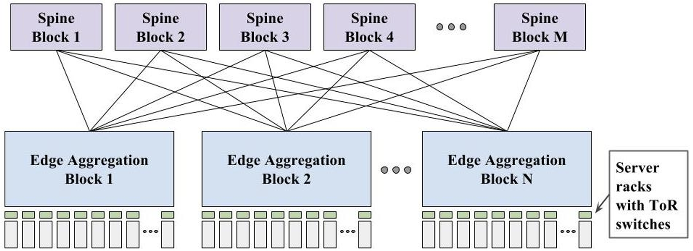

> The block model is not a different topology from Leaf-Spine. It is a way of **organizing and scaling** a Clos fabric beyond the point where the simple pod model becomes impractical. A two-tier leaf-spine is a single aggregation block with no spine block. A three-tier fabric with pods is two layers of aggregation blocks plus a single-tier spine block. The block model simply generalizes this to arbitrary depth.

The block-based Clos was pioneered by Google in their [Jupiter data center network](http://static.googleusercontent.com/media/research.google.com/en//pubs/archive/43837.pdf) (A. Singh et al., *Jupiter Rising: A Decade of Clos Topologies and Centralized Control in Google's Datacenter Network*, ACM SIGCOMM 2015). Jupiter arranged merchant switch silicon into a multi-stage Clos fabric delivering over 1 Petabit/sec of bisection bandwidth across 100,000+ servers — requiring 10,000+ individual switching elements managed through centralized SDN control rather than traditional distributed routing protocols.

The following diagram reveals the physical structure inside each block. Google builds both blocks from identical **merchant silicon** switch chips (16x40G ports each), packaged into custom switch units called **Centauri** (32x40G up + 32x40G down). Multiple Centauri switches are assembled into **Middle Blocks (MBs)**, which are then combined to form the full aggregation block (32 MBs, 512x40G uplinks) or spine block (128x40G downlinks to 64 aggregation blocks). The design is recursive: each level — chip, switch, middle block, full block — is a self-contained Clos, making the entire fabric a Clos-of-Closses.

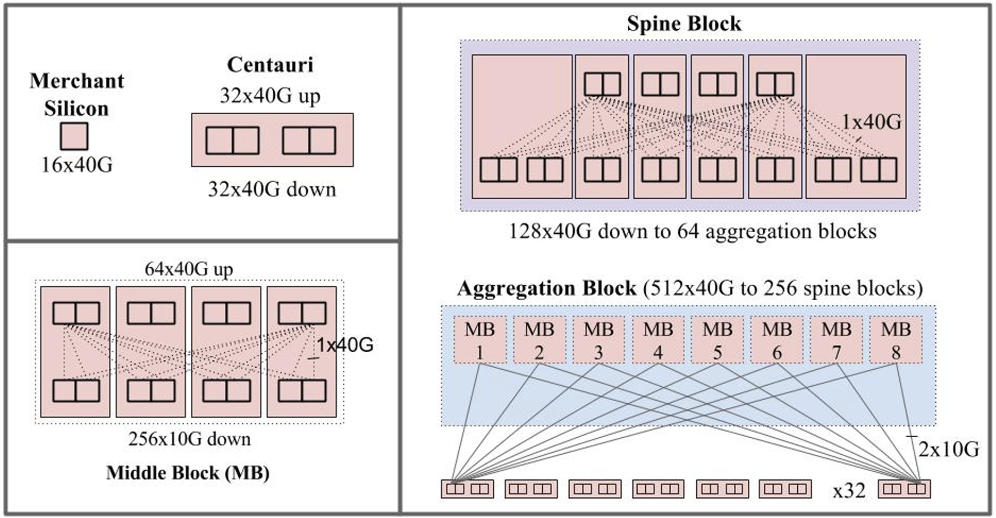

### Advanced Topologies for HPC and AI

**Fat-Tree**

The name "Fat-Tree" comes from a visual property of the topology. In a conventional tree network, every link has the same bandwidth so as traffic from many leaf nodes converges toward the root, the links near the top become bottlenecks. A Fat-Tree solves this by making the links progressively "fatter" (higher bandwidth) as you move up the tree. If you were to draw it, the lines near the root are thicker than the lines at the edges, giving the tree a visually "fat" top. In practice, the "fatness" is achieved not by using a single faster cable, but by running more parallel links between switches at each successive tier.

A Fat-Tree is formally described as a **k-ary fat-tree**, where *k* is the port count (radix) of every switch in the fabric. In a k-ary fat-tree, all switches are identical with *k* ports, and the topology is structured into three layers:

- **Edge (Leaf) switches:** Each edge switch dedicates *k/2* ports downward to servers and *k/2* ports upward to aggregation switches.
- **Aggregation switches:** Each aggregation switch connects *k/2* ports downward to edge switches within its pod and *k/2* ports upward to core switches.
- **Core switches:** Each core switch connects one port to each pod, stitching all pods together.

The switches are grouped into pods. A k-ary fat-tree contains *k* pods, each pod contains *k* switches (*k/2* edge + *k/2* aggregation), and each edge switch connects to *k/2* servers. The total number of servers the fabric supports is *k³/4*. For example, a 48-ary fat-tree using identical 48-port switches would support 27,648 servers.

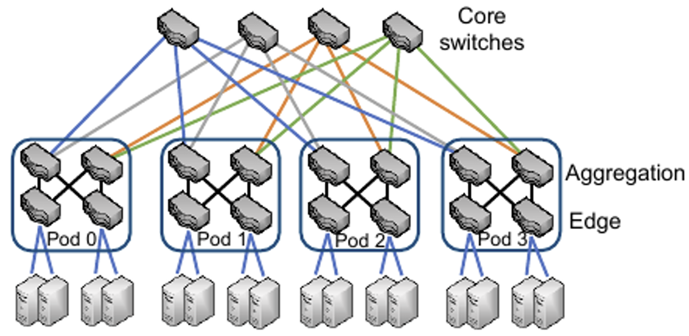

Because every tier has exactly enough aggregate uplink bandwidth to match the total downlink bandwidth of the tier below, the topology guarantees 100% full bisection bandwidth — a true 1:1 non-blocking ratio across the entire fabric. In a standard Leaf-Spine, operators may choose to oversubscribe the spine tier to reduce cost. A Fat-Tree eliminates this choice entirely.

The practical result is that any server can communicate with any other server at full line rate simultaneously, with zero contention at any point in the network. This makes Fat-Trees the dominant topology for tightly coupled GPU workloads (like distributed AI training), where a single slow link anywhere in the fabric forces every other GPU to wait.

The trade-off is cost. Achieving full bisection bandwidth requires a large number of switches (all with the same high radix *k*) and a massive volume of cabling. For workloads that can tolerate some oversubscription, a standard Leaf-Spine is significantly cheaper.

**Dragonfly**

At extreme scale, even a Fat-Tree becomes prohibitively expensive. A k-ary fat-tree requires *O(k³)* cables — the cabling cost grows cubically with the switch radix. Dragonfly was designed to dramatically reduce this cost by replacing the rigid, fully provisioned hierarchy of a Fat-Tree with a structure built on two tiers of connectivity: dense local links and sparse global links.

Each switch in a Dragonfly has its ports divided into three categories:

- **Compute links:** Ports connected downward to servers.
- **Local links:** Ports connected to other switches within the same group, typically wired as a full mesh so any two switches in the group are one hop apart.
- **Global links:** Ports connected to switches in other groups, providing inter-group reachability.

Switches are organized into groups (sometimes called "cabinets" in physical deployments). Within a group, switches are densely interconnected via local links. Between groups, each switch contributes a small number of global links to different remote groups. The key design rule is that every group has at least one direct global link to every other group, so any two endpoints in the entire fabric are reachable in at most three hops: local link (to reach the switch with the right global link) → global link (to reach the remote group) → local link (to reach the destination switch within that group). For endpoints within the same group, traffic takes at most one local hop.

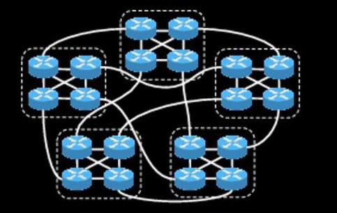

This low diameter (two to three hops maximum) is achieved with far fewer total cables than a Fat-Tree of equivalent server count, because the global links are sparse — each switch only needs a handful of them rather than a full uplink to every spine.

The trade-off is routing complexity. Because global links are sparse, they can become congestion hot spots under adversarial traffic patterns. If many flows from one group simultaneously need to reach the same remote group, the single global link between them saturates. Naive shortest-path routing cannot solve this — it would keep hammering the same congested direct link.

Dragonfly fabrics address this with **UGAL (Universal Globally Adaptive Load balancing)**. UGAL gives each switch a per-packet choice between two strategies:

- **Minimal routing:** Send the packet directly to the destination group over the shortest path (fewest hops).
- **Valiant routing:** Detour the packet through a randomly chosen intermediate group first, then forward it to the actual destination group. This spreads load across many global links at the cost of extra hops.

UGAL decides between the two by comparing the estimated congestion on the minimal path against the estimated congestion on the Valiant detour path. If the direct route is relatively clear, the packet takes the minimal path. If the direct route is congested, the packet is deflected through an intermediate group. This decision is made per-packet in hardware, allowing the fabric to dynamically balance load across its sparse global links.

Dragonfly is used in production supercomputers including Cray's Aries interconnect (powering Cray XC30/XC40 systems) and HPE's Slingshot fabric (powering Frontier, the first exascale supercomputer, and the HPE Cray EX platform).

### Server-Centric Topologies

All of the topologies discussed so far (Three-Tier, Leaf-Spine, Fat-Tree, and Dragonfly) are **switch-centric**. Dedicated network switches handle all packet forwarding, and servers are passive endpoints that only send and receive their own traffic.

A fundamentally different approach emerged from research at Microsoft Research and other institutions: **server-centric** topologies. In these designs, servers are equipped with multiple network interfaces and actively participate in forwarding traffic on behalf of other servers. A server is simultaneously an endpoint for its own workloads and a relay node for transit traffic. This eliminates the need for large, expensive top-tier switches entirely — the forwarding fabric is built out of the servers themselves.

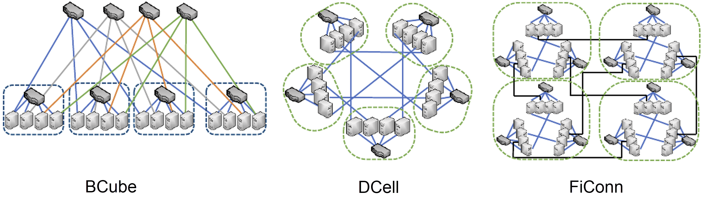

- **BCube:** A recursively defined topology designed for modular, containerized data centers. In a BCube of level 0, a group of servers connects to a single commodity switch. At level 1, multiple level-0 groups are interconnected by a second layer of switches, with each server gaining an additional NIC to connect to this new layer. Each additional level adds another NIC per server and another layer of switches, exponentially increasing the number of reachable servers. Because every server has multiple independent paths through different switch layers, BCube provides high fault tolerance and path diversity. It was specifically designed for shipping-container-scale deployments where the entire unit is treated as disposable.

- **DCell:** A recursively defined, purely server-routed topology. A level-0 DCell is a small group of servers connected to a single switch for local traffic. At higher levels, servers from different level-0 cells are connected directly to each other using additional NICs — no higher-tier switches are added. Servers route traffic for other servers across these inter-cell links. DCell scales exponentially (a level-3 DCell can interconnect millions of servers) and is extremely fault-tolerant because the recursive structure provides many redundant paths. The trade-off is that every server must run routing software and dedicate CPU cycles and NIC bandwidth to transit traffic.

- **FiConn:** A refinement of DCell that reduces the hardware cost. While DCell requires each server to have a growing number of NICs at higher recursion levels, FiConn achieves similar recursive inter-cell connectivity using only two NIC ports per server — one for local intra-cell traffic and one for inter-cell links. This makes it more practical to build with commodity server hardware, at the cost of somewhat lower path diversity and bisection bandwidth compared to DCell.

These server-centric topologies were influential in academic research and demonstrated that massive-scale networks could be built without expensive high-radix core switches. However, they have seen limited production deployment. The primary barriers are the CPU overhead of running routing and forwarding on every server, the operational complexity of managing a network where every server is also a router, and the rise of cheap, high-radix merchant silicon ASICs (like Broadcom's Tomahawk series) that made switch-centric Fat-Trees and Leaf-Spines cost-effective at the same scales these topologies were designed to reach.
